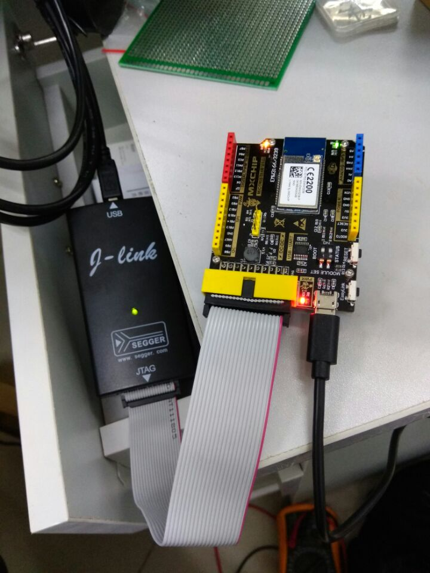
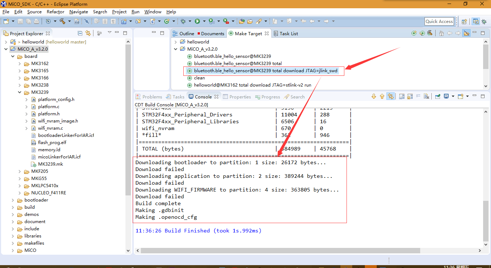
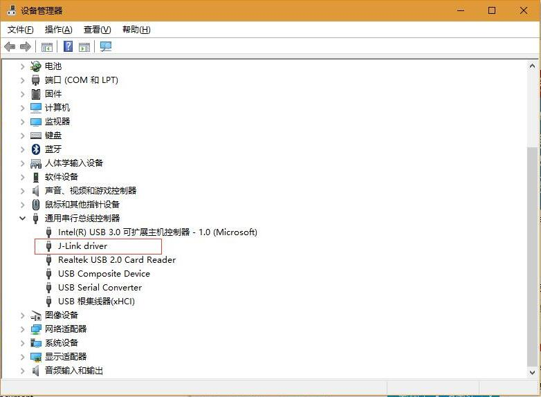
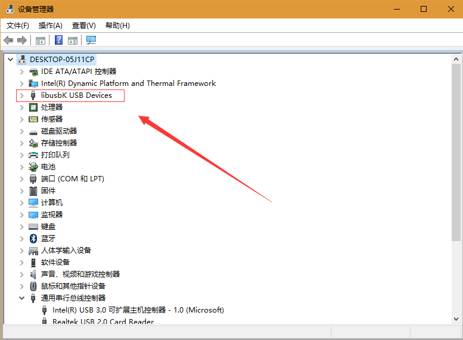
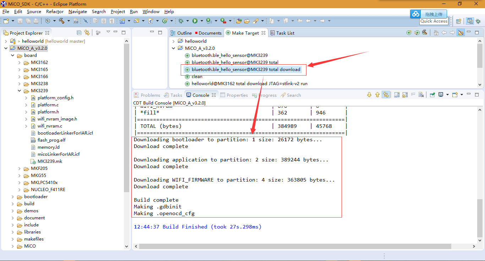

# EMW3239 Download Helloworld Demo

## Download 失败

设备连接如图：  

Download失败信息：  

错误原因是驱动JLink的驱动错了，在MiCO_SDK的IDE中，要换[《JTAG调试器的使用》](http://developer.mico.io/handbooks/89)中描述的驱动：  

## 重新安装驱动、烧录

这里是libusbK的驱动，原因是我的JLink使用libusb-win32无法驱动，[《JTAG调试器的使用》](http://developer.mico.io/handbooks/89)文档中有详细说明：  

烧录成功：  

