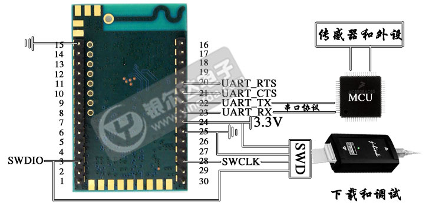
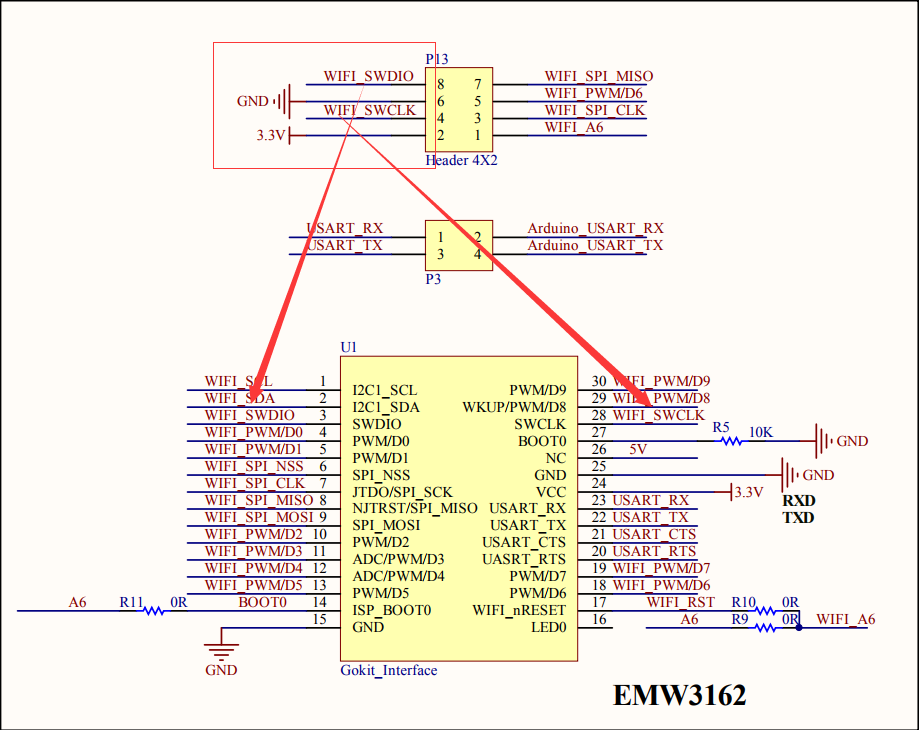
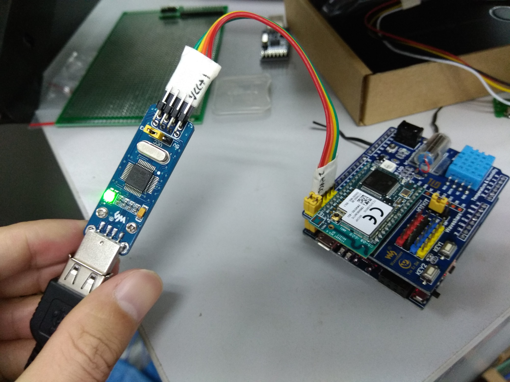

# Get Module And Download MiCO System

目标是采用[EMW3162模块](https://item.taobao.com/item.htm?spm=a1z10.5-c-s.w4002-16603296919.58.5e3b38dfFbWMQV&id=543818540167)学习MiCO系统。

目前购买了两套套件来学习，主要是因为最开始购买了[EMW3162 GoKit开发套件](https://item.taobao.com/item.htm?spm=a1z10.1-c-s.w5003-16605346609.11.26563f7asUT5I8&id=542968676812&scene=taobao_shop)，后来发现GoKit套件直接采用STLink不行，于是又购买了[MiCOKit-3239开发套件](https://item.taobao.com/item.htm?spm=a1z10.5-c-s.w4002-16603296919.21.1ef4d404lXIGYd&id=552768451049)，再后来分析EMW3162模块的时候发现其本身是支持JTAG（STLink）重新烧录MiCO系统的：

于是推测EMW3162 GoKit的[IOTKIT扩展板](https://item.taobao.com/item.htm?spm=2013.1.0.0.959eebeGjiZjD&id=525550020849&scm=1007.12144.81309.42296_42296&pvid=0f7c9def-25c0-460d-99c3-f1eaff2e057a)上外扩了STLink接口用于Download MiCO系统，通过看原理图，发现确实如此：

如下图接线就可以完成MiCO系统烧录：

## 搭建环境

参考官方提供MiCO环境搭建、测试文档：[http://developer.mico.io/handbooks](http://developer.mico.io/handbooks)

## 下面是尝试第一次download程序后的输出信息：
    11:27:20 **** Build of configuration Default for project MiCO_A_v3.2.0 ****
    "C:\\Users\\aplex\\Documents\\MiCO_SDK\\MiCO_A_v3.2.0\\make.exe" helloworld@MK3162 total download JTAG=stlink-v2 
    Building Bootloader...
    Finished Building Bootloader
    
    
                            MICO MEMORY MAP                            
    |=================================================================|
    | MODULE                                   | ROM       | RAM      |
    |=================================================================|
    | App_Helloworld                           | 158       | 0        |
    | Board_MK3162                             | 1056      | 92       |
    | crt0_GCC                                 | 272       | 0        |
    | FreeRTOS                                 | 5850      | 424      |
    | hardfault_handler                        | 991       | 0        |
    | libc                                     | 38859     | 2268     |
    | libgcc                                   | 3368      | 0        |
    | Lib_gpio_button_MK3162                   | 228       | 200      |
    | Lib_JSON_C                               | 6766      | 12       |
    | Lib_MiCO_Kernel                          | 12        | 12       |
    | Lib_MiCO_System                          | 26719     | 415      |
    | Lib_MiCO_System_QC                       | 1331      | 80       |
    | Lib_Utilities                            | 8641      | 0        |
    | Lib_wolfSSL.Cortex-M3.GCC.release        | 14846     | 8        |
    | LwIP                                     | 112       | 0        |
    | mem_newlib                               | 96        | 16       |
    | MiCO.1062.SDIO.Cortex-M3.GCC             | 102690    | 27872    |
    | MiCO_FreeRTOS_Interface                  | 3001      | 36       |
    | mico_system_power_daemon                 | 798       | 25       |
    | platform_vector_table                    | 0         | 0        |
    | stdio_newlib                             | 108       | 0        |
    | STM32F2xx                                | 4358      | 2215     |
    | STM32F2xx_Peripheral_Drivers             | 6245      | 223      |
    | STM32F2xx_Peripheral_Libraries           | 4854      | 16       |
    | *fill*                                   | 164       | 922      |
    |=================================================================|
    | TOTAL (bytes)                            | 231523    | 34836    |
    |=================================================================|
    Downloading bootloader to partition: 1 size: 23780 bytes... 
    Download complete 
    
    Downloading application to partition: 2 size: 238008 bytes... 
    Download complete 
    
    Downloading WIFI_FIRMWARE to partition: 4 size: 210412 bytes... 
    Download complete 
    
    Build complete
    Making .gdbinit
    Making .openocd_cfg
    
    11:27:35 Build Finished (took 15s.250ms)
    
    
