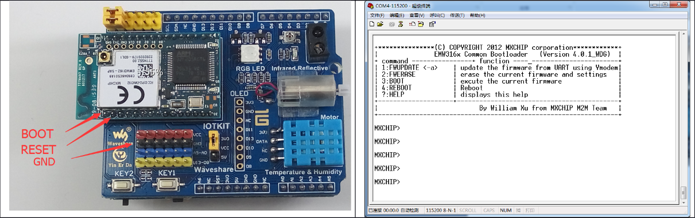
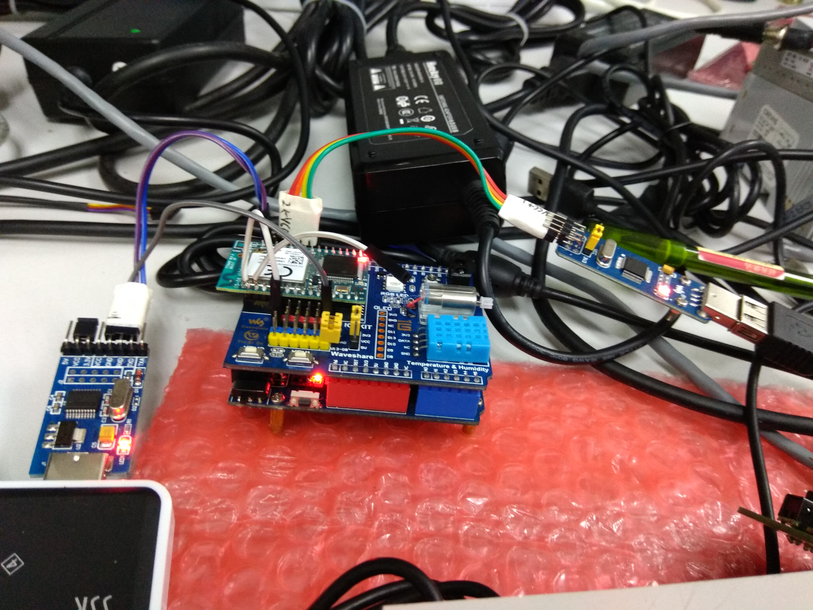
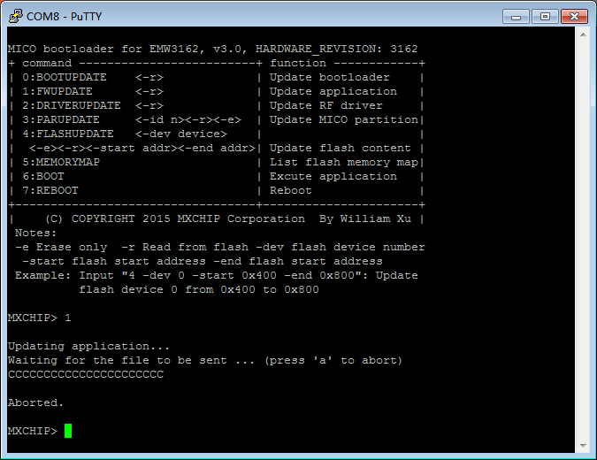

# GoKit Download Wifi Firmware

## 参考文档：
* 使用GOKIT给EMW3162和EMW3088下载固件.zip  

## 线路连接
焊接上图中的两个引脚，将Boot引脚引到GND上，将Reset信号线暂时先悬空，需要Reset的时候触碰一下GND就行。

## Debug Port
如下是Boot引脚一直接到GND上，Reset信号线触碰一下地址后的输出信息，接下来可以进行download了，由于目前使用Putty的原因，不支持文件传输的原因：

