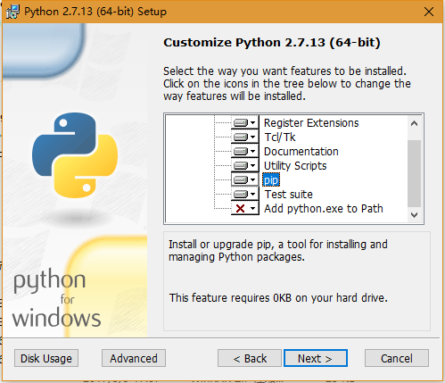
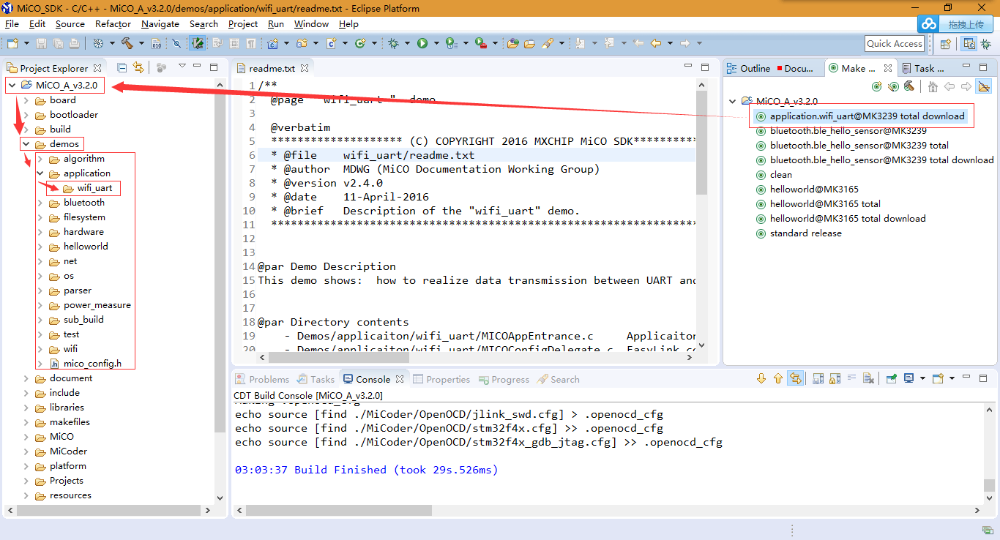

# MiCO Learning Note

## Notes

* [0005 wifi_uart_hacking.md](wifi_uart/wifi_uart_hacking.md)
* [0004 Makefle_hacking.md](Makefle_hacking.md)
* [0003 EMW3239_Download_Demo](EMW3239_Download_Demo.md)
* [0002 GoKit_Download_Wifi_Firmware.md](GoKit_Download_Wifi_Firmware.md)
* [0001 Get_Module_And_DownLoad.md](Get_Module_And_DownLoad.md)

## Description

* 参考文档：[http://developer.mico.io/](http://developer.mico.io/)
* 参考视频：[http://edu.mico.io/](http://edu.mico.io/)
* 参考Demo：
  * [配置环境](http://developer.mico.io/handbooks/8)；  
    请注意在安装Python的时候选择[pip插件](https://pypi.python.org/pypi/pip#downloads)，如果没有安装，请单独安装，[Google一下吧](http://bfy.tw/CymH)；
      
  * [IDE Download](http://developer.mico.io/handbooks/9)；
  * 在安装IDE之后，打开IDE就能看到默认的Demo了；
  * 根据[《0004 Makefle_hacking.md》](Makefle_hacking.md)中的分析，大体可知编译流程；
  * 编写学习、测试程序，可在Demo中直接使用，可边学习，边参考，以此完成任务。  
    
