# Schematic Hacking

* [核心板原理图](MiCOKit-3166-3239V0.1.pdf)
* [扩展板原理图](MiCOKit-EXT.pdf)

## 核心板原理图分析

* MCU引脚接口
  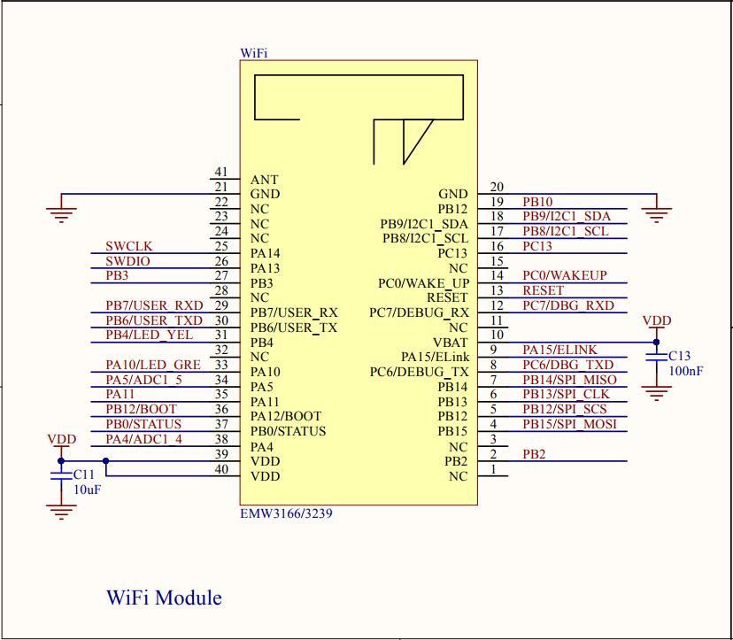
* 启动状态选择拨码  
  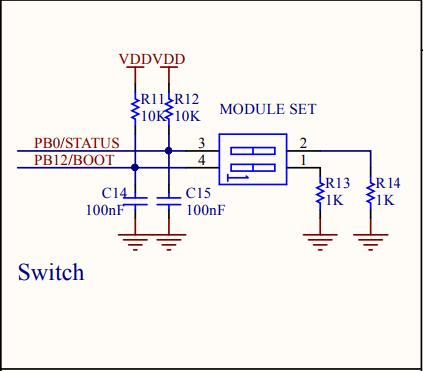
* 功耗检测电路
  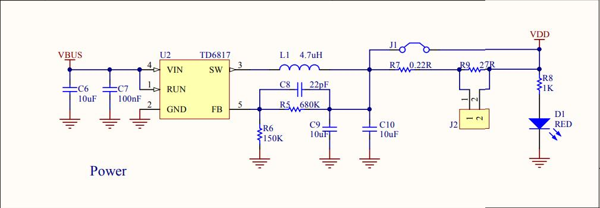
* Debug Port调试口  
  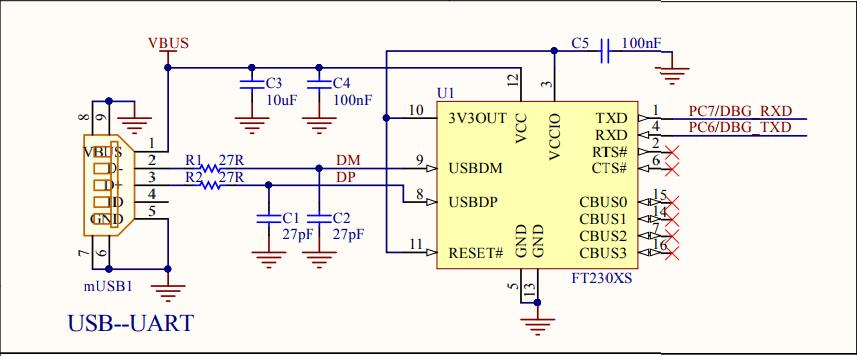
* SWD下载接口，虽然使用JTAG下载，但实际上使用SWD下载，可以直接用ST-Link下载；  
  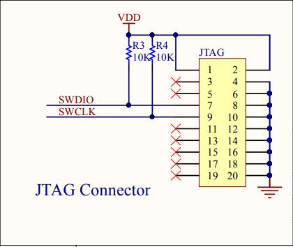
* Arduino接口  
  * VDD、VBUS电源；
  * Reset信号，当按下核心板上的Reset按键时，同时复位对应的外围传感器；
  * 2路ADC转换引脚；
  * 一路I2C（各种传感器）；
  * 一路SPI（OLED）；
  * 6个GPIO引脚；
  * 一路用户UART口（另一路被当做Debug Port了）；
  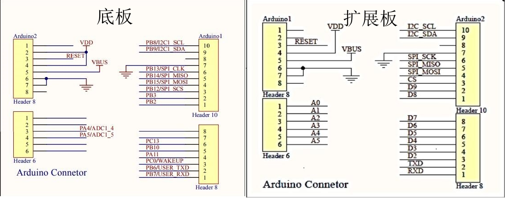

## 扩展板原理图分析

* OLED屏，SPI接口通信  
  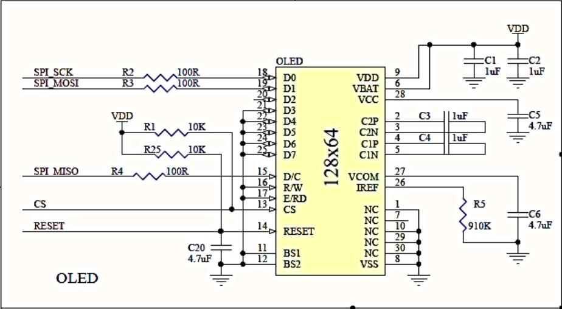
* RGB LED， I2C接口通信  
  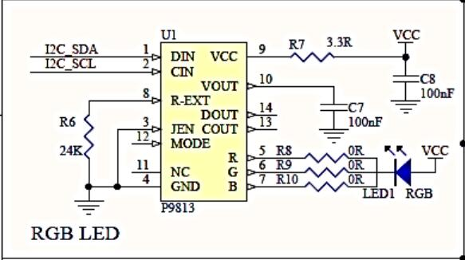
* 运动传感器，I2C接口通信  
  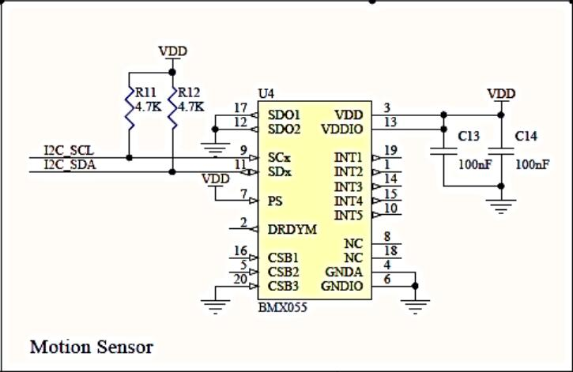
* 亮度测量，ADC转换  
  
* 红外反射，ADC转换  
  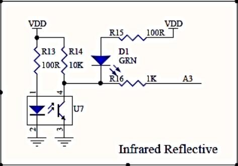
* 温湿度传感器  
  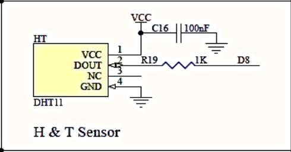
* 2路按键  
  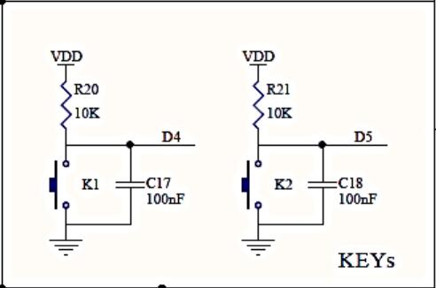
