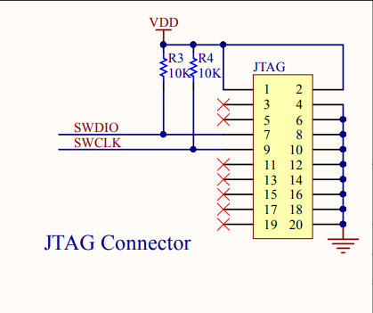
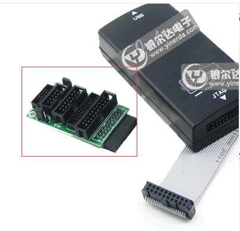
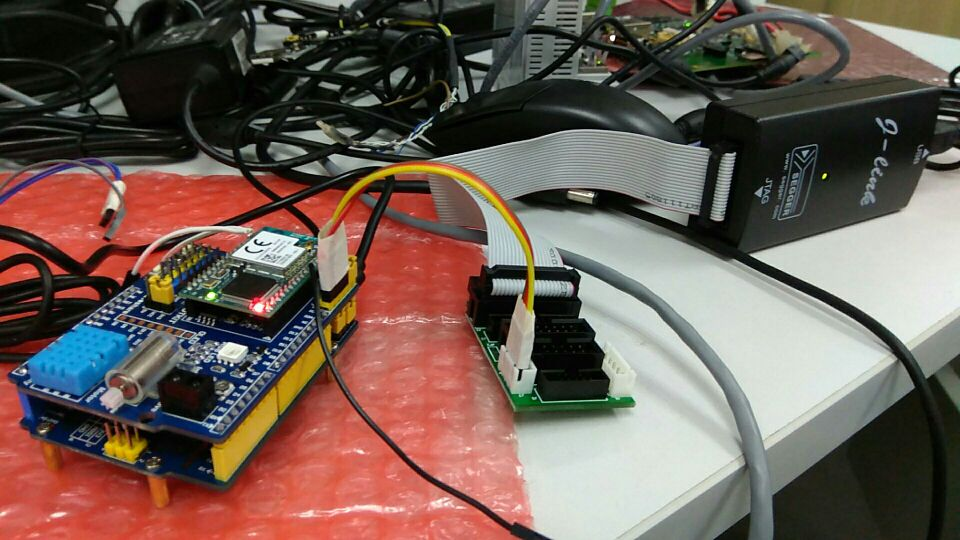
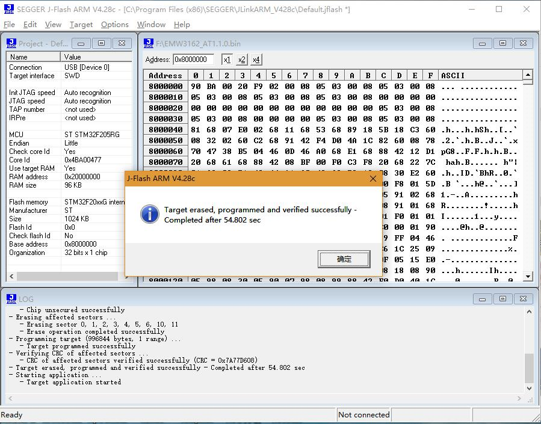
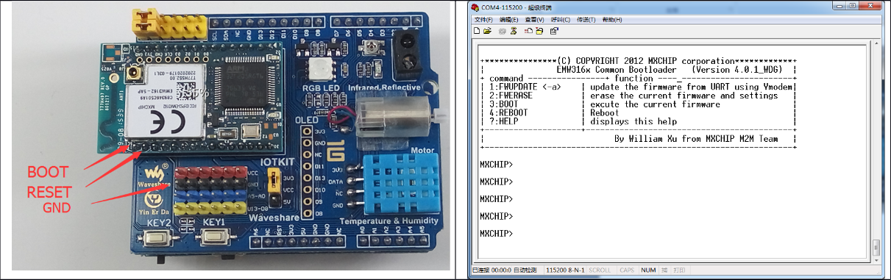
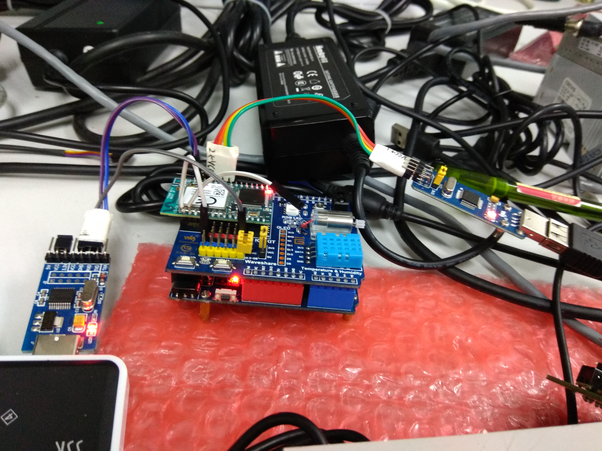
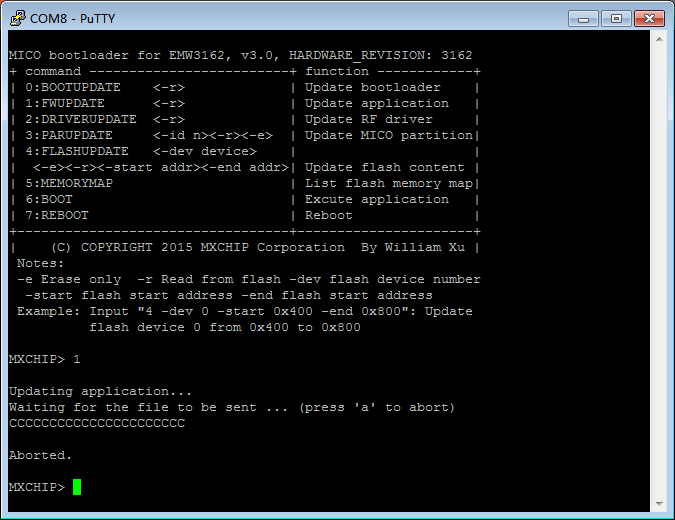
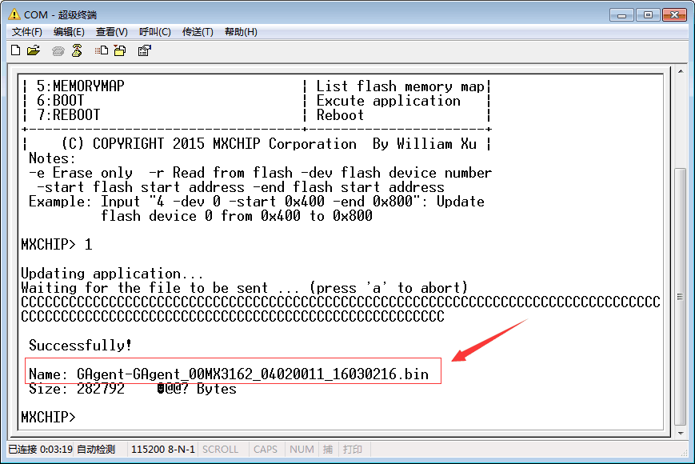
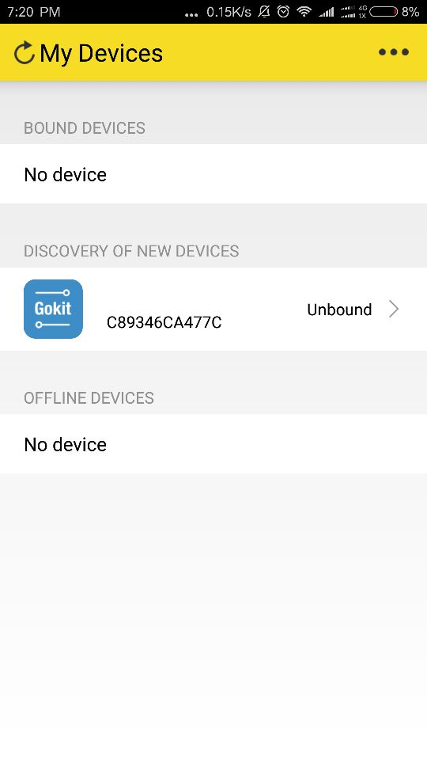

# GoKit Download Wifi Firmware

## 一、参考文档：

* [3162烧录1M文件方法-JLINK.zip](tools/3162烧录1M文件方法-JLINK.zip)
* [使用GOKIT给EMW3162和EMW3088下载固件.zip](tools/使用GOKIT给EMW3162和EMW3088下载固件.zip)

## 二、重新烧录bootloader

默认的3162的GoKit并不是跑MiCO系统的，但是因为我自己之前不知道，直接烧录了MiCO系统，导致BootLoader也烧录成了MiCO的Bootloader了，这样的话直接更新GAgent firmware是无效的，Wifi模块都不能正常的运行，所以要参考[《3162烧录1M文件方法-JLINK.zip》](tools/3162烧录1M文件方法-JLINK.zip)，使用JTAG Download新的对应的Firmware。

但是要将JTAG转换成SWD进行烧录，又不知道怎么接线，于是参考了[《MiCOKit-3166-3239 V0.1.pdf》](Schematic/MiCOKit-3166-3239V0.1.pdf)的JTAG接线方式：  

接下来又纠结与做转接头的问题，不过发现购买的JLINK中有这个玩意：  

于是乎就这样接线了：  

根据上面的文档进行烧录，可以烧录如下两个，烧录结果如下图：  
* EMW3162_AT1.1.0.bin
* EMW3162_0000.0000.AT14.bin  

## 三、更新GAgent firmware

参考[《使用GOKIT给EMW3162和EMW3088下载固件.zip》](tools/使用GOKIT给EMW3162和EMW3088下载固件.zip)中下图焊接电路引脚：

焊接上图中的两个引脚，将Boot引脚引到GND上，将Reset信号线暂时先悬空，需要Reset的时候触碰一下GND就行。

如下是Boot引脚一直接到GND上，Reset信号线触碰一下地址后的输出信息，接下来可以进行download了，由于目前使用Putty的原因，不支持文件传输的原因：

使用参考工具里的串口工具烧录完成界面如图：  

## 四、Wifi Config

**[Download App Config Network](http://dev.gizwits.com/zh-cn/developer/resource/open_source)**

