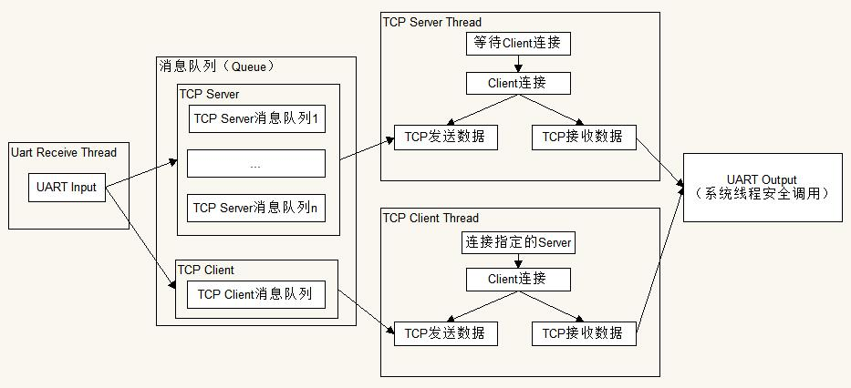

# WiFi Uart Demo Hacking

## 参考文档：

* [RM1016CN_MiCO_SDK_Demo_Function_Description.pdf](../tools/RM1016CN_MiCO_SDK_Demo_Function_Description.pdf)
* [http://developer.mico.io/api/](http://developer.mico.io/api/)

## 软件运行框架

* 添加了注释的源代码：[uart_wifi](src)；
* `application_start()`函数入口文件：[src/MICOAppEntrance.c](src/MICOAppEntrance.c)
* 软件框架图如下：



## 大体函数调用

* int application_start( void )
  * mico_context = mico_system_context_init( sizeof(application_config_t) );  
  初始化系统系统context（直接翻译为上下文，个人觉得这个context可以译为全局变量，mico_context可以认为是mico系统全局变量）。
  * err = mico_system_init( mico_context );  
  系统初始化。
  * err = mico_rtos_create_thread( NULL, MICO_APPLICATION_PRIORITY, "UART Recv", uartRecv_thread, STACK_SIZE_UART_RECV_THREAD, (mico_thread_arg_t)app_context );  
  创建串口接收数据线程。
    * recvlen = _uart_get_one_packet(inDataBuffer, UART_ONE_PACKAGE_LENGTH);  
    获取一包UART数据。
    * sppUartCommandProcess(inDataBuffer, recvlen, Context);  
    对UART接收到的数据进行处理，其实这里是将UART数据放入每个TCP有效的Socket消息队列中。
        ```
            mico_rtos_lock_mutex(&inContext->appStatus.queue_mtx);
            socket_msg_take(real_msg);
            for(i=0; i < MAX_QUEUE_NUM; i++) {
              p_queue = inContext->appStatus.socket_out_queue[i];
              if(p_queue  != NULL ){
                socket_msg_take(real_msg);
                if (kNoErr != mico_rtos_push_to_queue(p_queue, &real_msg, 0)) {
                  socket_msg_free(real_msg);
              }
            }
            socket_msg_free(real_msg);
            mico_rtos_unlock_mutex(&inContext->appStatus.queue_mtx);
        ```
  * err = mico_rtos_create_thread( NULL, MICO_APPLICATION_PRIORITY, "Local Server", localTcpServer_thread, STACK_SIZE_LOCAL_TCP_SERVER_THREAD, (mico_thread_arg_t)app_context );  
  创建TCP Server端线程。
    * j = accept(localTcpListener_fd, (struct sockaddr *)&addr, (socklen_t *)&sockaddr_t_size);   
    等待Clinet端连接。
    * if(kNoErr != mico_rtos_create_thread(NULL, MICO_APPLICATION_PRIORITY, "Local Clients", localTcpClient_thread, STACK_SIZE_LOCAL_TCP_CLIENT_THREAD, (mico_thread_arg_t)&j) )   
    创建连接到Server端的Client端处理线程。
        ```
            ...
            // 创建、初始化用于数据处理的消息队列，这个消息队列中的数据主要是串口传递过来的数据
            err = socket_queue_create(context, &queue);
            eventFd = mico_create_event_fd(queue);
            ...
            
            while(1){

              FD_ZERO(&readfds);
              FD_SET(clientFd, &readfds); 
              FD_SET(eventFd, &readfds);      // 这是与串口通信的消息队列生成的fd

              // 等待串口有数据发送过来了，可读
              select( Max(clientFd, eventFd) + 1, &readfds, NULL, NULL, &t);
              /* send UART data */
              if (FD_ISSET( eventFd, &readfds )) { // have data and can write
                  FD_ZERO(&writeSet );
                  FD_SET(clientFd, &writeSet );
                  t.tv_usec = 100*1000; // max wait 100ms.
                  // 等待网络可写，因为网络有时候可能处于忙状态，这样可以保证网络发送数据成功率
                  select(clientFd + 1, NULL, &writeSet, NULL, &t);
                  if((FD_ISSET( clientFd, &writeSet )) &&
                      (kNoErr == mico_rtos_pop_from_queue( &queue, &msg, 0))) {
                     sent_len = write(clientFd, msg->data, msg->len);
                     if (sent_len <= 0) {
                        len = sizeof(errno);
                        getsockopt(clientFd, SOL_SOCKET, SO_ERROR, &errno, (socklen_t *)&len);
                        socket_msg_free(msg);
                        server_log("write error, fd: %d, errno %d", clientFd, errno );
                        if (errno != ENOMEM) {
                            goto exit_with_queue;
                        }
                     } else {
                            socket_msg_free(msg);
                        }
                     }
                  }

              /*Read data from tcp clients and process these data using HA protocol */ 
              // 前面处理了串口读的数据，这里处理网络读的数据
              if (FD_ISSET(clientFd, &readfds)) {
                len = recv(clientFd, inDataBuffer, wlanBufferLen, 0);
                require_action_quiet(len>0, exit_with_queue, err = kConnectionErr);
                sppWlanCommandProcess(inDataBuffer, &len, clientFd, context);
              }
            }
        ```
  * err = mico_rtos_create_thread( NULL, MICO_APPLICATION_PRIORITY, "Remote Client", remoteTcpClient_thread, STACK_SIZE_REMOTE_TCP_CLIENT_THREAD, (mico_thread_arg_t)app_context );  
  创建Client连接远程的Server端。
    ```
        // 注册两个文件描述符事件
        FD_ZERO(&readfds);
        FD_SET(remoteTcpClient_fd, &readfds);
        FD_SET(eventFd, &readfds); 
        
        t.tv_sec = 4;
        t.tv_usec = 0;
        // 等待TCP、消息队列中有数据需要处理
        select( Max(remoteTcpClient_fd, eventFd) + 1, &readfds, NULL, NULL, &t);
        /* send UART data */
        if (FD_ISSET( eventFd, &readfds )) {// have data 
          FD_ZERO(&writeSet );
          FD_SET(remoteTcpClient_fd, &writeSet );
          t.tv_usec = 100*1000; // max wait 100ms.
          // 等待TCP数据传输空闲，当空闲时进行数据传输
          select(1 + remoteTcpClient_fd, NULL, &writeSet, NULL, &t);
          if ((FD_ISSET(remoteTcpClient_fd, &writeSet )) && 
              (kNoErr == mico_rtos_pop_from_queue( &queue, &msg, 0))) {
             sent_len = write(remoteTcpClient_fd, msg->data, msg->len);
             if (sent_len <= 0) {
              len = sizeof(errno);
              getsockopt(remoteTcpClient_fd, SOL_SOCKET, SO_ERROR, &errno, (socklen_t *)&len);
        
              socket_msg_free(msg);
              if (errno != ENOMEM) {
                  client_log("write error, fd: %d, errno %d", remoteTcpClient_fd,errno );
                  goto ReConnWithDelay;
              }
             } else {
                      socket_msg_free(msg);
                  }
              }
        }

        /*recv wlan data using remote client fd*/
        // 从TCP传输中获取数据
        if (FD_ISSET(remoteTcpClient_fd, &readfds)) {
          len = recv(remoteTcpClient_fd, inDataBuffer, wlanBufferLen, 0);
          if(len <= 0) {
            client_log("Remote client closed, fd: %d", remoteTcpClient_fd);
            goto ReConnWithDelay;
          }
          sppWlanCommandProcess(inDataBuffer, &len, remoteTcpClient_fd, context);
        }
    ```
