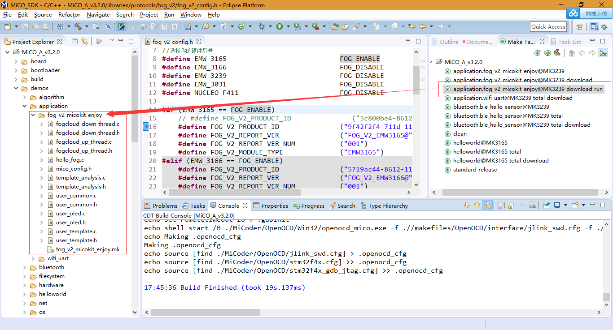
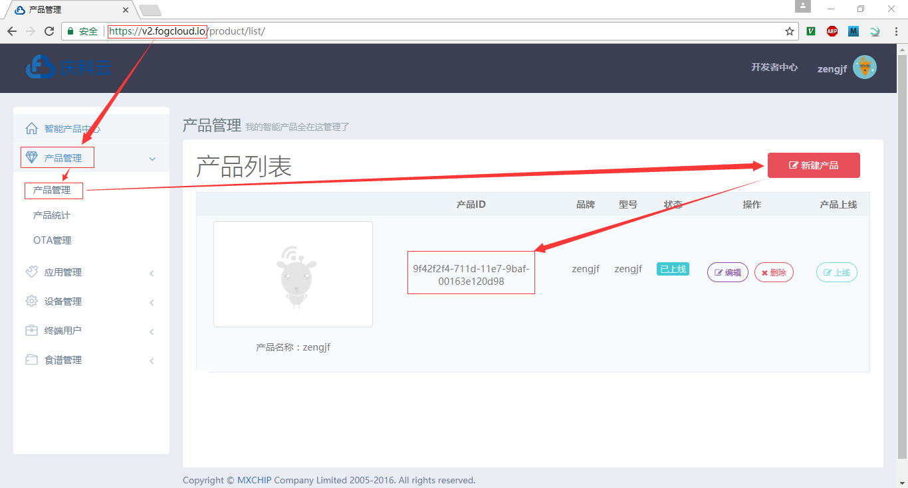

# Import MiCO Enjoy Project

## 参考文档 

* [MiCO总动员](http://developer.mico.io/developer/md/bWljby1oYW5kYm9vay83Lk9wZW5fc291cmNlX3Byb2plY3QvMS5NaUNPX2Vuam95Lm1k)
* [MiCO总动员源码](http://developer.mico.io/developer/md/bWljby1oYW5kYm9vay9Eb3dubG9hZC85Lk1pQ09fRW5qb3lfU0RLLm1k)

## MiCO总动员源码文件夹文件说明

* lib/mqtt | mqtt客户端源码(版本v0.1.9)，**MICOSDK3.2版本之后已经包含了此文件夹**
* lib/fog_v2 | 与FOGCLOUD V2后台的交互逻辑(版本v2.6.0)
* application/fog_v2_micokit_enjoy | 为庆科的MiCOKIT开发板制作的应用程序,支持硬件`MiCOkit-3165`、`MiCOkit-3166`、`MiCOkit-3239`、`MiCOkit-3031`
* application/fog_v2_nucleo_enjoy  | 为庆科的MiCOKIT开发板制作的应用程序,支持硬件`MiCOkit-NUCEOF411`

>**注意：fog_v2和mqtt文件夹的内容是一个依赖于MiCOSDK的中间件，为上层应用提供基础API支撑，fog_v2_micokit_enjoy和fog_v2_nucleo_enjoy为依托于具体硬件设备的应用案例**

## 使用步骤

* 将fog_v2和mqtt文件夹复制到MiCOSDK工程目录`<MiCO SDK path>/libraries/protocols/`中 根据当前你的硬件平台,将`application`文件夹里面的应用程序demo复制到MiCOSDK工程目录`<MiCO_SDK path>/demos/application`中
  
* 在FogCloud后台创建一个新的产品,得到新的产品ID。将lib/fog_v2文件夹中的`fog_v2_config.h`中的` FOG_V2_PRODUCT_ID `宏定义替换成云端创建得到的产品ID。*我这里的数据表格是没有设置任何字段的，因为还不知道要设置什么字段。*
  * [庆科云](https://v2.fogcloud.io/)
  * 产品ID：  
    
* 使用Android总动员App去配置网络（App下载到参考文档《MiCO总动员》中扫码下载）；

