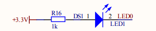
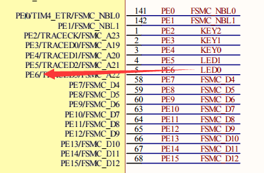

# GPIO Control Test Porject

仅仅是系统通过一个很简单的Demo来测试一下Keil 5编译的软件，通过JLink SW烧录方式是否OK。

## 原理图

* LED接线  
  
* LED引脚  
  

## 源代码

```
#include "stm32f10x_gpio.h"

void delay(unsigned int count)
{
	int i;
	for(i=0;i<count;i++);
}

#define LED0_OFF GPIO_SetBits(GPIOE,GPIO_Pin_6); 
#define LED0_ON  GPIO_ResetBits(GPIOE,GPIO_Pin_6); 

int main()
{
	GPIO_InitTypeDef GPIO_InitStructure;
	RCC_APB2PeriphClockCmd(RCC_APB2Periph_GPIOE,ENABLE); 
	
	GPIO_InitStructure.GPIO_Pin=GPIO_Pin_6 ;            
    GPIO_InitStructure.GPIO_Speed=GPIO_Speed_50MHz;  
    GPIO_InitStructure.GPIO_Mode=GPIO_Mode_Out_PP;  
	
    GPIO_Init(GPIOE,&GPIO_InitStructure); 
	
    while(1)
	{
		LED0_ON;
		delay(0x2fffff);
		LED0_OFF;
		delay(0x2fffff);
	}
}
```
