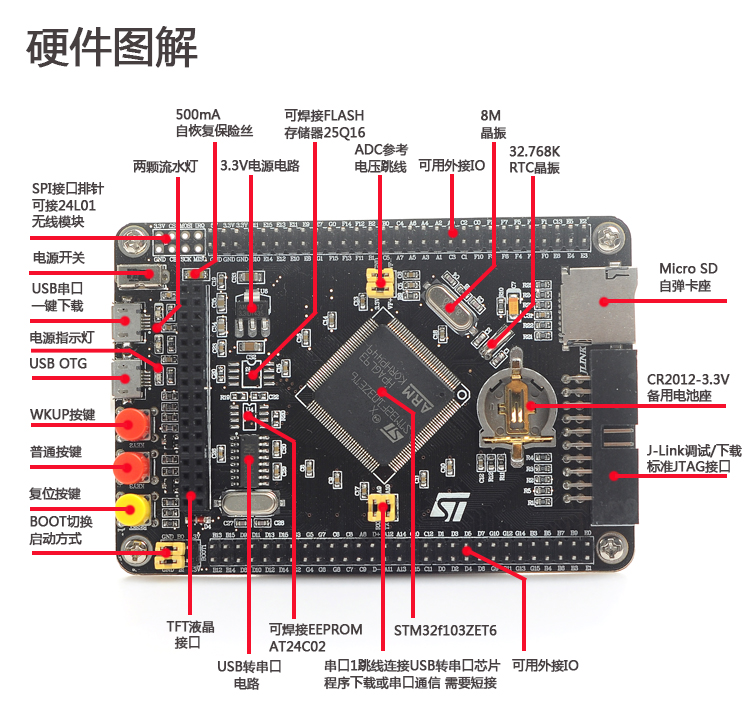
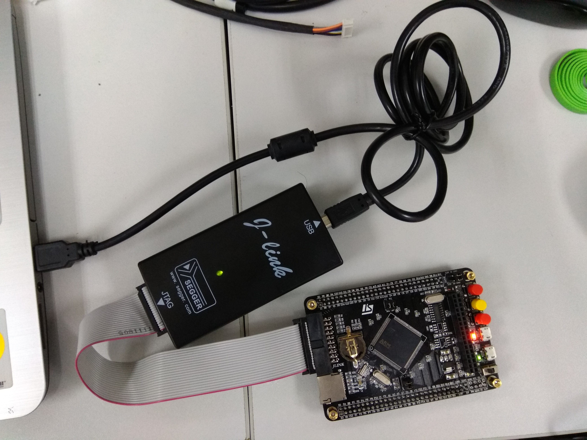

# STM32F103ZET6

* [STM32开发板 STM32核心板 STM32F103ZET6最小系统板arm cortex-M3](https://item.taobao.com/item.htm?spm=a1z09.2.0.0.2ed6e797TyOpRb&id=44397497604&_u=4cfhpg21a28)
* [STM32F407ZET6/ZGT6开发板 Cortex-M4 STM32最小系统板arm学习板](https://item.taobao.com/item.htm?spm=a1z09.2.0.0.2ed6e797TyOpRb&id=524482277610&_u=4cfhpg259ef)

## 示例源代码

* [CMSIS代码项目](https://github.com/ZengjfOS/MiCONotes/tree/master/src/0008_STM32F103ZET6/src/projects/CMSIS)
* [StdPeriph代码项目](https://github.com/ZengjfOS/MiCONotes/tree/master/src/0008_STM32F103ZET6/src/projects/StdPeriph)

## 学习测试项目

* [017_CMSIS-Driver_UART2_Port](src/017_CMSIS-Driver_UART2_Port.md)
* [016_GPIO_AFIO_STM32_Datasheet_Hacking](src/016_GPIO_AFIO_STM32_Datasheet_Hacking.md)
* [015_CMSIS-Driver_I2C_Slave](src/015_CMSIS-Driver_I2C_Slave.md)
* [014_Command_Line_Interpreter](src/014_Command_Line_Interpreter.md)
* [013_CMSIS-Driver_UART_As_Debug_Port](src/013_CMSIS-Driver_UART_As_Debug_Port.md)
* [012_Keil_JSON_Parse_Lib](src/012_Keil_JSON_Parse_Lib.md)
* [011_External_Interrupt_With_CMSIS_RTOS](src/011_External_Interrupt_With_CMSIS_RTOS.md)
* [010_Learning_FreeRTOS_And_CMSIS_RTOS](src/010_Learning_FreeRTOS_And_CMSIS_RTOS.md)
* [009_Uart1_As_Debug_Port](src/009_Uart1_As_Debug_Port.md)
* [008_Keil_Manage_a_Multi-Project](src/008_Keil_Manage_a_Multi-Project.md)
* [007_Vim_As_Keil_Editor](src/007_Vim_As_Keil_Editor.md)
* [006_Header_File_Relationship](src/006_Header_File_Relationship.md)
* [005_Use_Keil_Help_For_Work](src/005_Use_Keil_Help_For_Work.md)
* [004_GPIO_Control_Test_Project](src/004_GPIO_Control_Test_Project.md)
* [003_Clock_Setting_Hacking](src/003_Clock_Setting_Hacking.md)
* [002_Boot_Code(startup_stm32f10x_hd.s)_Hacking](src/002_Boot_Code_Hacking.md)
* [001_Create_Project](src/001_Create_Project.md)

## 硬件资源

原理图：[STM32F103ZET6_Schematics.pdf](tools/STM32F103ZET6_Schematics.pdf)

## 硬件连接图

## Tools

* [JLinker download](src/jlink.zip)  
这里需要注意的就是，之前安装MiCO的JLink驱动，导致在安装的时候遇到总是识别为libusb设备，即使卸载了，还是这样，处理办法是卸载了libusb之后，再卸载JLink驱动，重新安装对应的上面的Jlink驱动，载卸载libusb驱动，就可以了。

