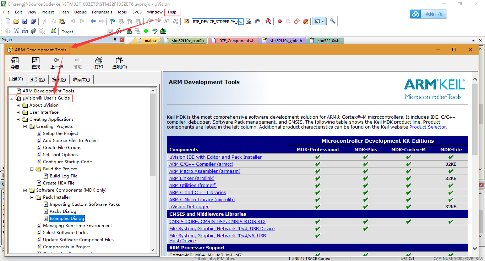

# Use Keil Help For Work

## Keil Help 

## Information

* 在网络上目前还没有很多有关于Keil 5的使用方法说明，也许Keil自带的Help就是最好的教程了；
* Creating Projects中的内容在前面已经操作过了，基本上和help中的描述是一致的；
* 所以参考这里面的内容其实是很好的，譬如如何找Example这个也是不错的提示；
* help里面并不是面面俱到，其最主要的还是当作一个引子，可以从整体上知道软件的架构要如何去处理；
