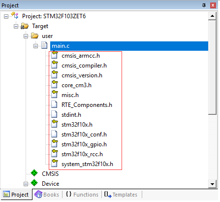
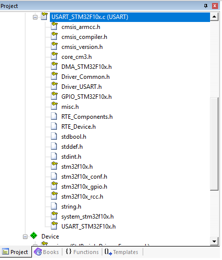
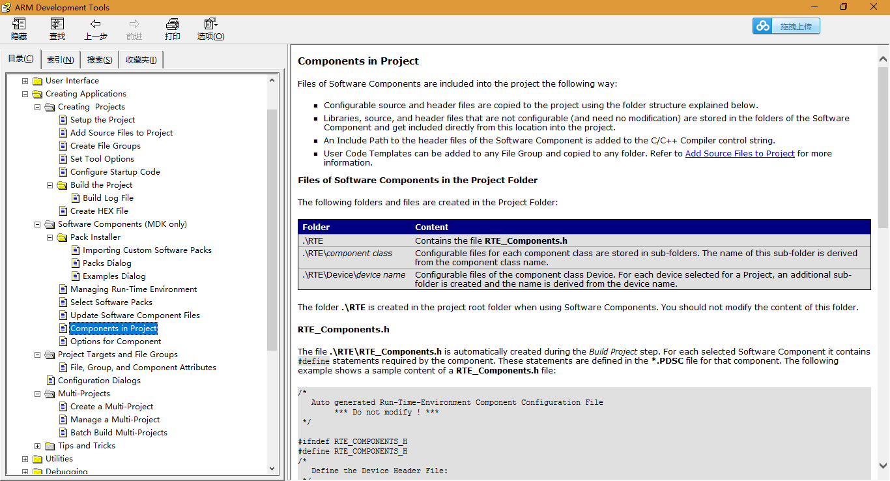
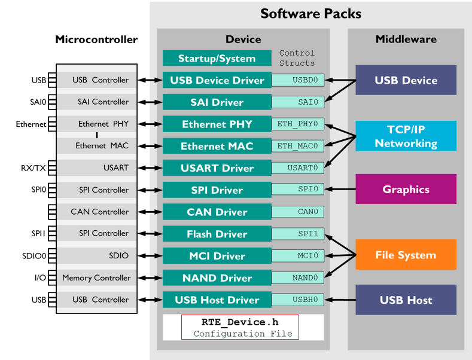
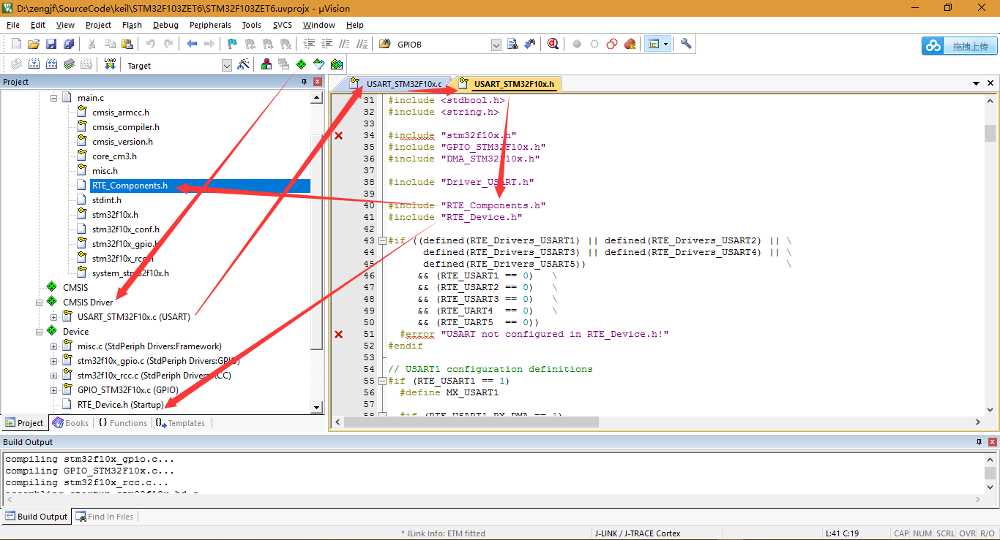
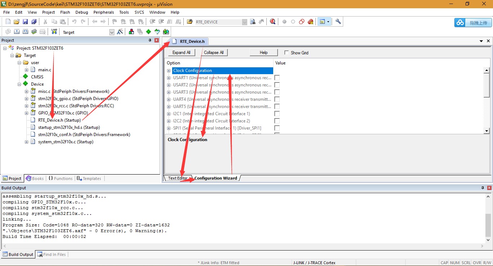
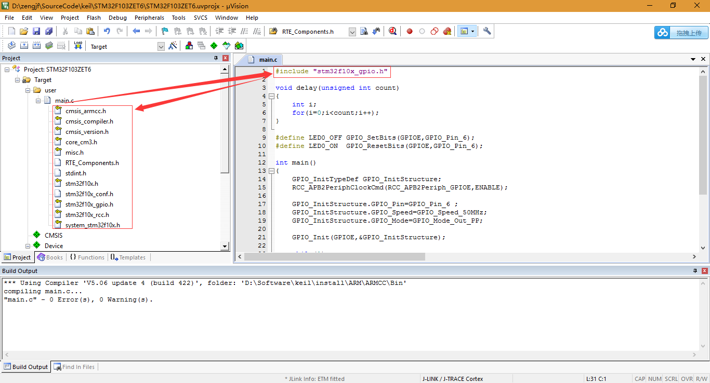

# Header File Relationship

## 头文件架构

* StdPeriph库头文件架构  
  
* CMSIS库头文件架构  
  

## 头文件关系解析

* RTE_Components.h：  
    
  Auto generated Run-Time-Environment Component Configuration File,  ** Do not modify ! **, automatically created during the Build Project step. For each selected Software Component it contains #define statements required by the component. 
* RTE_Device.h  
  
    
  * CMSIS(Cortex Microcontroller Software Interface Components): CMSIS is essentially just register definitions and no code, so CMSIS == direct register access. Keep in mind that CMSIS, unlike the other two, is defined by ARM and not ST. "CMSIS" is the Cortex Microcontroller Software Interface Standard. It's an ARM standard, so the code should be more or less portable between Cortex implementations.
    * [CMSIS](http://www2.keil.com/mdk5/cmsis/)
    * [CMSIS Workshop](http://www2.keil.com/mdk5/learn/cmsis_workshop/)
    * [CMSIS-Driver](http://www.keil.com/pack/doc/CMSIS/Driver/html/index.html)
    * [MDK Middleware](http://www2.keil.com/mdk5/middleware/)
    * [CMSIS vs HAL vs Standard Peripherals Library](https://electronics.stackexchange.com/questions/224355/cmsis-vs-hal-vs-standard-peripherals-library)
    * [CMSIS and peripherals drivers](https://stackoverflow.com/questions/25681041/cmsis-and-peripherals-drivers)
  * [Option 1: Configuration via RTE_Device.h](https://www.keil.com/pack/doc/STM32Cube/General/html/classic.html)
    * This file is best viewed using the Configuration Wizard.
    * [Configuration Wizard](http://www.keil.com/support/man/docs/uv4/uv4_ut_configwizard.htm):  
      
    * 这是STM32需要使用的外设的使能和引脚配置。
  * [Configuration via RTE_Device.h](http://www.keil.com/pack/doc/sam_esv7/general/html/classic_pg.html)
* stm32f10x_gpio.h
  
  * stm32f10x.h
    * core_cm3.h
      * stdint.h
      * cmsis_version.h
      * cmsis_compiler.h
        * cmsis_armcc.h
      * mpu_armv7.h
    * system_stm32f10x.h
    * stdint.h
    * stm32f10x_conf.h
      * RTE_Components.h
      * stm32f10x_rcc.h
      * stm32f10x_gpio.h
      * misc.h
    * RTE_Components.h

## 结论

* RTE_device.h是属于CMSIS中要使用的部分；
* 两套可使用库：
  * StdPeriph Drivers
  * CMSIS Driver

