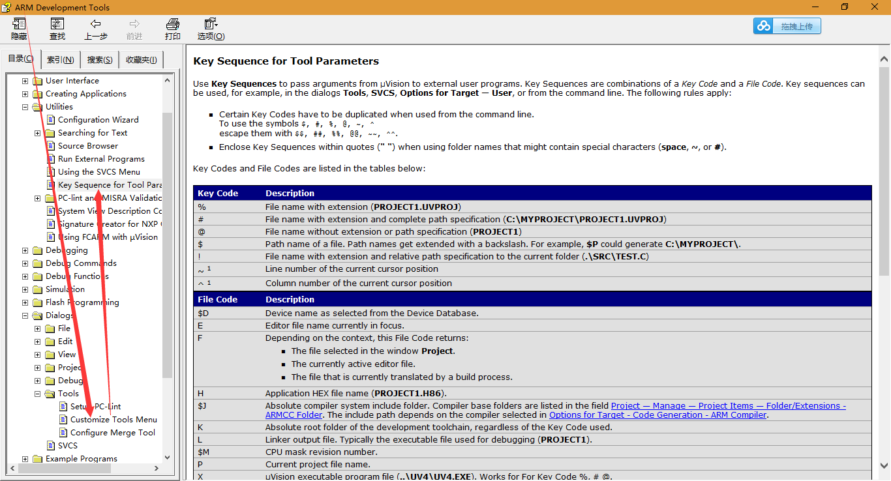

# Vim As Editor

## 参考资料

* [µVISION: USING AN EXTERNAL EDITOR](http://www.keil.com/support/docs/1803.htm)

## 处理方法

* Select **Customize Tools Menu...** from the **Tools** menu.
* Add a description for your editor to the Menu Content box. You may specify an ampersand ('&') to specify the hot-key.
* Enter the command required to launch your editor in the Command input line. For example, to start Notepad under Windows 2000, enter **C:\WINNT\NOTEPAD.EXE**.
* Enter **#F** in the **Arguments** text box. If you don't want your editor to automatically open the source file, you may omit this step.
  
* 如上所述，在Windows下面，需要提前安装gvim
