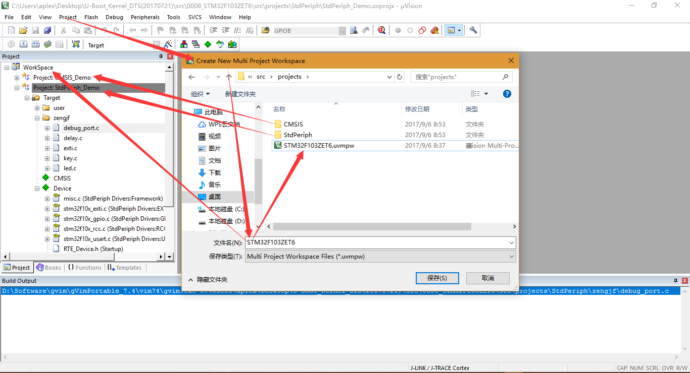

# Manage a Multi-Project

## 参考资料

* [Manage a Multi-Project](http://www.keil.com/support/man/docs/uv4/uv4_ca_managemultiprojectfile.htm)

## 使用情况

## 总结

个人感觉唯一的不好的地方就是，使用的是绝对路径，如果换了一个开发环境路径，好像就会找不到project路径。
