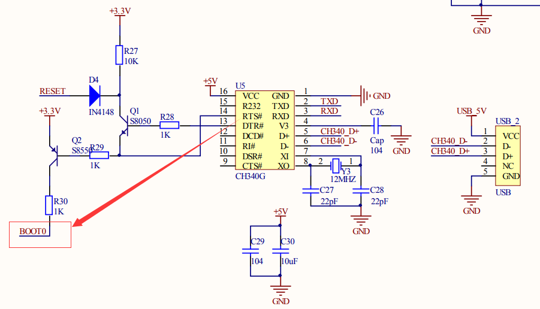
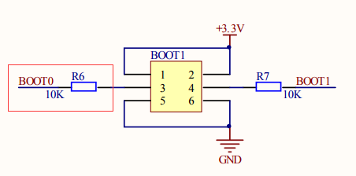

# Uart1 As Debug Port

## 注意事项

* 使用Putty、SecureCRT这两个软件进行通信的时候，Boot0引脚自动变高，如果按了Reset按键，就会进入串口下载模式，而不仅仅是Reset；  
  
* 仅作为主板的使用者，并不打算去深究其中的原因，直接短路掉R6，Boot0永远被拉低，也就不支持串口下载了；  
  
* 使用普通的串口助手进行通信的时候，如果按了Reset按键，并不会进入串口下载模式，会Reset，可能普通的串口工具都没有去控制那个RTS引脚的导致的吧；

## 相关处理函数、头文件

* 相关的头文件
  ```C
  #include <stdio.h>
  #include <stdarg.h>
  ```

* 配置UART1口：
  ```C
  void USART1_Config(int baudrate)
  {
      GPIO_InitTypeDef GPIO_InitStructure;
      USART_InitTypeDef USART_InitStructure;
  
      /* 配置串口1 （USART1） 时钟*/
      RCC_APB2PeriphClockCmd(RCC_APB2Periph_USART1 | RCC_APB2Periph_GPIOA, ENABLE);
      /*串口GPIO端口配置*/
      /* 配置串口1 （USART1 Tx (PA.09)）*/
      GPIO_InitStructure.GPIO_Pin = GPIO_Pin_9;
      GPIO_InitStructure.GPIO_Mode = GPIO_Mode_AF_PP;
      GPIO_InitStructure.GPIO_Speed = GPIO_Speed_50MHz;
      GPIO_Init(GPIOA, &GPIO_InitStructure);    
      /* 配置串口1 USART1 Rx (PA.10)*/
      GPIO_InitStructure.GPIO_Pin = GPIO_Pin_10;
      GPIO_InitStructure.GPIO_Mode = GPIO_Mode_IN_FLOATING;
      GPIO_InitStructure.GPIO_Speed = GPIO_Speed_50MHz;
      GPIO_Init(GPIOA, &GPIO_InitStructure);
  
      /* 串口1工作模式（USART1 mode）配置 */
      USART_InitStructure.USART_BaudRate = baudrate;    //一般设置为115200;
      USART_InitStructure.USART_WordLength = USART_WordLength_8b;
      USART_InitStructure.USART_StopBits = USART_StopBits_1;
      USART_InitStructure.USART_Parity = USART_Parity_No ;
      USART_InitStructure.USART_HardwareFlowControl = USART_HardwareFlowControl_None;
      USART_InitStructure.USART_Mode = USART_Mode_Rx | USART_Mode_Tx;
      USART_Init(USART1, &USART_InitStructure); 
      USART_Cmd(USART1, ENABLE);//使能串口
  }
  ```
* 重定向c库函数printf到USART1
  ```C
  int fputc(int ch, FILE *f)
  {
      /* 将Printf内容发往串口 */
      USART_SendData(USART1, (unsigned char) ch);
      while( USART_GetFlagStatus(USART1,USART_FLAG_TC)!= SET);  
      
      led_toggle(GPIOE, GPIO_Pin_6);
      
      return (ch);
  }
  ```
* 重定向c库函数scanf到USART1，支持实时回显
  ```C
  int fgetc(FILE *f)
  {
      while (USART_GetFlagStatus(USART1, USART_FLAG_RXNE) == RESET);
      
      led_toggle(GPIOE, GPIO_Pin_6);
      
      int ch = (int)USART_ReceiveData(USART1); 
  
      if (ch == '\r' || ch == '\n')
      {
          fputc('\n', f);
          fputc('\r', f);
      } else {
          fputc(ch, f);
      }
      
      return ch;
  }
  ```
* 主函数调用demo
  ```C
  int main(void)
  {    
      USART1_Config(115200);
      LED_GPIO_Config();
  
      printf("\r\n Hardware Auto Detect System.");
      printf("\r\n Version: 0.0.1");
      printf("\r\n           ---- Designed By zengjf \r\n");
      
      char str[512] = {0};
  
      while(1)
      {
          scanf("%s", str);
          memset(str, 0, strlen(str));
      }
  }
  ```
