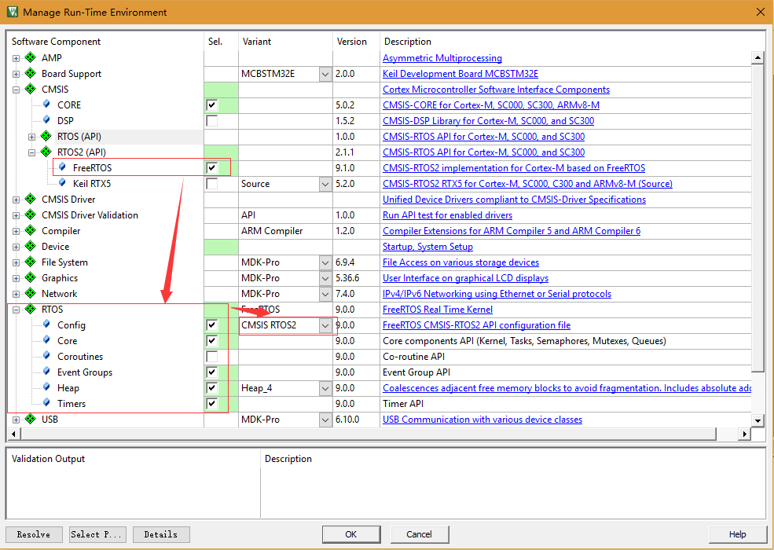

# Learning FreeRTOS And CMSIS RTOS

## 参考资料

* [ARM Cortex-M3 (STM32F103) Tutorial - FreeRTOS - Task](http://embeddedsystemengineering.blogspot.com/2016/04/arm-cortex-m3-stm32f103-tutorial.html)
* [CMSIS-RTOS Choices: Keil RTX or FreeRTOS](http://www.keil.com/pr/article/1280.htm)
* [CMSIS-RTOS2  Version 2.1.1](http://www.keil.com/pack/doc/CMSIS/RTOS2/html/index.html)
* [cmsis_os2.h header file](http://www.keil.com/pack/doc/CMSIS/RTOS2/html/genRTOS2IF.html#cmsis_os2_h)
* [Function Overview](http://www.keil.com/pack/doc/CMSIS/RTOS2/html/functionOverview.html)
* [Thread Examples](http://www.keil.com/pack/doc/CMSIS/RTOS2/html/group__CMSIS__RTOS__ThreadMgmt.html#thread_examples)

## Keil FreeRTOS And CMSIS RTOS Select



## FreeRTOS接口编码demo

* 相关头文件
  ```C
  #include "FreeRTOS.h"
  #include "task.h"
  ```
* 示例代码：
  ```C
  #include "zengjf.h"
  #include "FreeRTOS.h"
  #include "task.h"
  
  char str[512] = {0};
      
  void vTaskLedRed(void *p)
  {
      for (;;)
      {
          led_toggle(GPIOE, GPIO_Pin_6);
          Delay(0x1FFFFF);
      }
  }
  
  void vTaskDebugPort(void *p)
  {
  
      for (;;)
      {
          scanf("%s", str);
          memset(str, 0, strlen(str));
      }
  }
  
  int main(void)
  {	
      USART1_Config(115200);
      LED_GPIO_Config();
  
      printf("\r\n Hardware Auto Detect System.");
      printf("\r\n Version: 0.0.1");
      printf("\r\n           ---- Designed By zengjf \r\n");
      
      xTaskCreate(vTaskLedRed, (const char*) "Red LED Blink", 128, NULL, 1, NULL);
      xTaskCreate(vTaskDebugPort, (const char*) "Debug Port", 128, NULL, 1, NULL);
  
      // Start RTOS scheduler
      vTaskStartScheduler();
      
      return 0;
  }
  ```
  
## CMSIS RTOS接口编程
* 涉及头文件
  ```C
  #include "cmsis_os2.h"
  ```
* 示例代码：
  ```C
  #include "zengjf.h"
  #include "cmsis_os2.h"
  
  char str[512] = {0};
      
  void vTaskLedRed(void *p)
  {
      for (;;)
      {
          led_toggle(GPIOE, GPIO_Pin_6);
          Delay(0x1FFFFF);
      }
  }
  
  void vTaskDebugPort(void *p)
  {
  
      for (;;)
      {
          scanf("%s", str);
          memset(str, 0, strlen(str));
      }
  }
  
  int main(void)
  {    
      USART1_Config(115200);
      LED_GPIO_Config();
  
      printf("\r\n Hardware Auto Detect System.");
      printf("\r\n Version: 0.0.1");
      printf("\r\n           ---- Designed By zengjf \r\n");
      
      // System Initialization
      SystemCoreClockUpdate();
      #ifdef RTE_Compiler_EventRecorder
      // Initialize and start Event Recorder
      EventRecorderInitialize(EventRecordError, 1U);
      #endif
  
      osKernelInitialize();                       // Initialize CMSIS-RTOS
      osThreadNew(vTaskLedRed, NULL, NULL);       // Create application main thread
      osThreadNew(vTaskDebugPort, NULL, NULL);    // Create application main thread
      osKernelStart();                            // Start thread execution
  }
    
  ```
