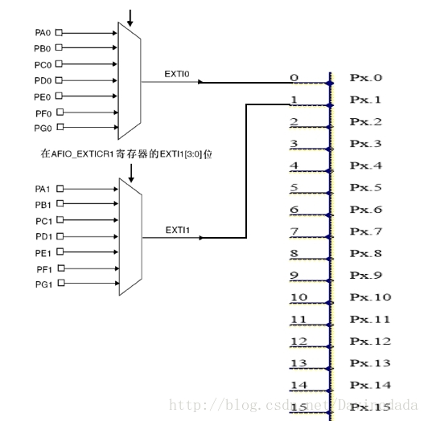

# External Interrupt With CMSIS RTOS

## 参考资料

### 工作原理

* [学习STM32(2)-IO-AFIO(复用功能IO和调试配置)](http://blog.csdn.net/k122769836/article/details/7700153)
* [STM32-AFIO的使用](http://j1o1y.blog.sohu.com/300071648.html)
* [STM32 APB2 AFIO时钟什么时候需要开启](http://www.rationmcu.com/stm32/1541.html)
* [STM32之外部中断 EXTI](http://blog.csdn.net/Davincdada/article/details/70652888)
* [Multiple interrupts on the same EXTI Line STM32](https://stackoverflow.com/questions/36438879/multiple-interrupts-on-the-same-exti-line-stm32)
* [How to distinguish between GPIO interrupts from the same interrupt handler?](https://electronics.stackexchange.com/questions/298780/how-to-distinguish-between-gpio-interrupts-from-the-same-interrupt-handler)
* [External interrupts in stm32f10x](https://electronics.stackexchange.com/questions/267286/external-interrupts-in-stm32f10x)

### RTOS中使用外部中断

* [Blinky on STM32F4 with FreeRTOS, STMCube and HAL](http://khjtony.github.io/project/2015/12/22/TinyCar_Blinky.html)

## 中断线理解

* STM32的每个IO口都可以作为外部中断源的输入端，而IO口使用的中断线只有16根；
* 引脚GPIOx.0~GPIOx.15(x=A~G)分别对应中断线0-15.这样每个中断线对应了7个IO口。如线0对应引脚GPIOA.0/GPIOB.0/GPIOC.0/GPIOD.0/GPIOE.0/GPIOF.0/GPIOG.0；
* 每个中断线每次只能连接到1个IO口上，即同一时刻EXTIx只能响应一个端口的事件触发，不能同时响应所有IO端口的事件，但可以分时复用。



## 裸机中断

* 中断处理函数
  ```C
  void EXTI0_IRQHandler(void)
  {     
      /*延时消抖*/
      Delay(10000);    
      /*检查指定的EXTI0线路触发请求发生与否*/    
      if(EXTI_GetITStatus(EXTI_Line0) != RESET)      
      {      
          /*控制LED的IO电平翻转*/
          led_toggle(GPIOE, GPIO_Pin_5);
      }
      /*清除EXTI0线路挂起位*/
      EXTI_ClearITPendingBit(EXTI_Line0);  
  }
  
  void EXTI4_IRQHandler(void)
  {   
      /*延时消抖*/
      Delay(10000);               
      /*检查指定的EXTI13线路触发请求发生与否*/    
      if(EXTI_GetITStatus(EXTI_Line4) != RESET)
      {   
          /*控制LED的IO电平翻转*/
          led_toggle(GPIOE, GPIO_Pin_5);
      }
      /*检查指定的EXTI15线路触发请求发生与否*/    
  
      /*清除EXTI13线路挂起位*/
      EXTI_ClearITPendingBit(EXTI_Line4); 
  
  }
  ```
* 中断配置
  ```C
  static void NVIC_Configuration(void)
  {
      NVIC_InitTypeDef NVIC_InitStructure;
      /*设置NVIC中断分组2:2位抢占优先级，2位响应优先级*/
      NVIC_PriorityGroupConfig(NVIC_PriorityGroup_2);    
  
      /*使能按键所在的外部中断通道*/
      NVIC_InitStructure.NVIC_IRQChannel = EXTI4_IRQn;
      /*设置抢占优先级，抢占优先级设为2*/    
      NVIC_InitStructure.NVIC_IRQChannelPreemptionPriority = 0x02;    
      /*设置子优先级，子优先级设为1*/
      NVIC_InitStructure.NVIC_IRQChannelSubPriority = 0x01;        
      /*使能外部中断通*/
      NVIC_InitStructure.NVIC_IRQChannelCmd = ENABLE;    
      /*根据NVIC_InitStruct中指定的参数初始化外设NVIC寄存器*/        
      NVIC_Init(&NVIC_InitStructure); 
  
      /*使能按键所在的外部中断通道*/
      NVIC_InitStructure.NVIC_IRQChannel = EXTI0_IRQn;            
      /*设置抢占优先级，抢占优先级设为2*/    
      NVIC_InitStructure.NVIC_IRQChannelPreemptionPriority = 0x02;    
      /*设置子优先级，子优先级设为2*/
      NVIC_InitStructure.NVIC_IRQChannelSubPriority = 0x02;        
      /*使能外部中断通*/
      NVIC_InitStructure.NVIC_IRQChannelCmd = ENABLE;    
      /*根据NVIC_InitStruct中指定的参数初始化外设NVIC寄存器*/    
      NVIC_Init(&NVIC_InitStructure);       
  
  }
  
  void EXTI_Config(void)
  {
      GPIO_InitTypeDef GPIO_InitStructure;
      EXTI_InitTypeDef EXTI_InitStructure;
  
      /* 开启外设时钟 */
      RCC_APB2PeriphClockCmd(RCC_APB2Periph_GPIOA|RCC_APB2Periph_AFIO, ENABLE);
      RCC_APB2PeriphClockCmd(RCC_APB2Periph_GPIOE|RCC_APB2Periph_AFIO, ENABLE);
  
      /* 初始化 GPIOE.4  设置为上拉输入 */
      GPIO_InitStructure.GPIO_Pin  = GPIO_Pin_4;
      GPIO_InitStructure.GPIO_Mode = GPIO_Mode_IPU;
      GPIO_Init(GPIOE, &GPIO_InitStructure);
      /* 初始化 GPIOA.0      设置为下拉输入*/
      GPIO_InitStructure.GPIO_Pin  = GPIO_Pin_0;
      GPIO_InitStructure.GPIO_Mode = GPIO_Mode_IPD; 
      GPIO_Init(GPIOA, &GPIO_InitStructure);
  
      /* GPIOE.4 中断线配置，将相应的GPIO引脚连到相应中断线上 */
      // GPIOE.4的中断线就是连在GPIO_PINSOURCE4上的，可以看前面的参考文档
      GPIO_EXTILineConfig(GPIO_PortSourceGPIOE, GPIO_PinSource4);
  
      /* GPIOE.4 中断初始化配置 */
      // 由于前面已经设置好了GPIO_PINSOURCE4，所以这里EXTI_Line4就表示了是GPIO_PINSOURCE4上的中断了
      EXTI_InitStructure.EXTI_Line    = EXTI_Line4;
      EXTI_InitStructure.EXTI_Mode    = EXTI_Mode_Interrupt;    
      EXTI_InitStructure.EXTI_Trigger = EXTI_Trigger_Falling;
      EXTI_InitStructure.EXTI_LineCmd = ENABLE;
      /* 根据EXTI_InitStruct中指定的参数初始化外设EXTI寄存 */
      EXTI_Init(&EXTI_InitStructure);     
  
      /* GPIOA.0 中断线配置，将相应的GPIO引脚连到相应中断线上 */
      GPIO_EXTILineConfig(GPIO_PortSourceGPIOA, GPIO_PinSource0);
  
      /* GPIOA.0 中断初始化配置 */
      EXTI_InitStructure.EXTI_Line    = EXTI_Line0;
      EXTI_InitStructure.EXTI_Mode    = EXTI_Mode_Interrupt;    
      EXTI_InitStructure.EXTI_Trigger = EXTI_Trigger_Rising;
      EXTI_InitStructure.EXTI_LineCmd = ENABLE;
      /* 根据EXTI_InitStruct中指定的参数初始化外设EXTI寄存器 */
      EXTI_Init(&EXTI_InitStructure);        
  
      /* 配置中断控制器NVIC */
      NVIC_Configuration();
  
  }
  ```
* 中断测试调用
  ```C
  #include "zengjf.h"
  
  int main(void)
  {    
      USART1_Config(115200);
      LED_GPIO_Config();
      EXTI_Config();
      
      printf("\r\n Hardware Auto Detect System.");
      printf("\r\n Version: 0.0.1");
      printf("\r\n           ---- Designed By zengjf \r\n");
      
      while(1) {
          led_toggle(GPIOE, GPIO_Pin_6);
          Delay(0x1FFFFF);
      }
  }
  ```

## CMSIS RTOS 测试

* 中断处理函数
  ```C
  extern osSemaphoreId_t sid_Thread_Semaphore; 
  
  void EXTI0_IRQHandler(void)
  {     
      osSemaphoreRelease (sid_Thread_Semaphore);
  
      EXTI_ClearITPendingBit(EXTI_Line0); 
  }
  
  void EXTI4_IRQHandler(void)
  {   
      osSemaphoreRelease (sid_Thread_Semaphore);
      
      EXTI_ClearITPendingBit(EXTI_Line4); 
  }
  ```
* 中断配置
  ```C
  static void EXTI_NVIC_Configuration(void)
  {
      NVIC_InitTypeDef NVIC_InitStructure;
      /*设置NVIC中断分组2:2位抢占优先级，2位响应优先级*/
      // NVIC_PriorityGroupConfig(NVIC_PriorityGroup_2);     // remove this line
  
      /*使能按键所在的外部中断通道*/
      NVIC_InitStructure.NVIC_IRQChannel = EXTI4_IRQn;
      /*设置抢占优先级，抢占优先级设为2*/    
      NVIC_InitStructure.NVIC_IRQChannelPreemptionPriority = 0x02;    
      /*设置子优先级，子优先级设为1*/
      NVIC_InitStructure.NVIC_IRQChannelSubPriority = 0x01;        
      /*使能外部中断通*/
      NVIC_InitStructure.NVIC_IRQChannelCmd = ENABLE;    
      /*根据NVIC_InitStruct中指定的参数初始化外设NVIC寄存器*/        
      NVIC_Init(&NVIC_InitStructure); 
  
      /*使能按键所在的外部中断通道*/
      NVIC_InitStructure.NVIC_IRQChannel = EXTI0_IRQn;            
      /*设置抢占优先级，抢占优先级设为2*/    
      NVIC_InitStructure.NVIC_IRQChannelPreemptionPriority = 0x02;    
      /*设置子优先级，子优先级设为2*/
      NVIC_InitStructure.NVIC_IRQChannelSubPriority = 0x02;        
      /*使能外部中断通*/
      NVIC_InitStructure.NVIC_IRQChannelCmd = ENABLE;    
      /*根据NVIC_InitStruct中指定的参数初始化外设NVIC寄存器*/    
      NVIC_Init(&NVIC_InitStructure);       
  
  }
  
  void EXTI_Config(void)
  {
      GPIO_InitTypeDef GPIO_InitStructure;
      EXTI_InitTypeDef EXTI_InitStructure;
  
      /* 开启外设时钟 */
      RCC_APB2PeriphClockCmd(RCC_APB2Periph_GPIOA|RCC_APB2Periph_AFIO, ENABLE);
      RCC_APB2PeriphClockCmd(RCC_APB2Periph_GPIOE|RCC_APB2Periph_AFIO, ENABLE);
  
      /* 初始化 GPIOE.4  设置为上拉输入 */
      GPIO_InitStructure.GPIO_Pin  = GPIO_Pin_4;
      GPIO_InitStructure.GPIO_Mode = GPIO_Mode_IPU;
      GPIO_Init(GPIOE, &GPIO_InitStructure);
      /* 初始化 GPIOA.0      设置为下拉输入*/
      GPIO_InitStructure.GPIO_Pin  = GPIO_Pin_0;
      GPIO_InitStructure.GPIO_Mode = GPIO_Mode_IPD; 
      GPIO_Init(GPIOA, &GPIO_InitStructure);
  
      /* GPIOE.4 中断线配置，将相应的GPIO引脚连到相应中断线上 */
      // GPIOE.4的中断线就是连在GPIO_PINSOURCE4上的，可以看前面的参考文档
      GPIO_EXTILineConfig(GPIO_PortSourceGPIOE, GPIO_PinSource4);
  
      /* GPIOE.4 中断初始化配置 */
      // 由于前面已经设置好了GPIO_PINSOURCE4，所以这里EXTI_Line4就表示了是GPIO_PINSOURCE4上的中断了
      EXTI_InitStructure.EXTI_Line    = EXTI_Line4;
      EXTI_InitStructure.EXTI_Mode    = EXTI_Mode_Interrupt;    
      EXTI_InitStructure.EXTI_Trigger = EXTI_Trigger_Falling;
      EXTI_InitStructure.EXTI_LineCmd = ENABLE;
      /* 根据EXTI_InitStruct中指定的参数初始化外设EXTI寄存 */
      EXTI_Init(&EXTI_InitStructure);     
  
      /* GPIOA.0 中断线配置，将相应的GPIO引脚连到相应中断线上 */
      GPIO_EXTILineConfig(GPIO_PortSourceGPIOA, GPIO_PinSource0);
  
      /* GPIOA.0 中断初始化配置 */
      EXTI_InitStructure.EXTI_Line    = EXTI_Line0;
      EXTI_InitStructure.EXTI_Mode    = EXTI_Mode_Interrupt;    
      EXTI_InitStructure.EXTI_Trigger = EXTI_Trigger_Rising;
      EXTI_InitStructure.EXTI_LineCmd = ENABLE;
      /* 根据EXTI_InitStruct中指定的参数初始化外设EXTI寄存器 */
      EXTI_Init(&EXTI_InitStructure);        
  
      /* 配置中断控制器NVIC */
      EXTI_NVIC_Configuration();
  }
  ```
* 中断测试调用
  ```C
  #include "zengjf.h"
  
  char str[512] = {0};
  osSemaphoreId_t sid_Thread_Semaphore; 
  int count = 0;
      
  void vTaskLedRed(void *p)
  {
      for (;;)
      {
          led_toggle(GPIOE, GPIO_Pin_6);
          Delay(0x1FFFFF);
      }
  }
  
  void vTaskEXTILed(void *p)
  {
      for (;;)
      {
          osSemaphoreAcquire (sid_Thread_Semaphore, osWaitForever);
          led_toggle(GPIOE, GPIO_Pin_5);
          printf("EXTI Count Value: %d\r\n", count++);
      }
  }
  
  void vTaskDebugPort(void *p)
  {
      for (;;)
      {
          scanf("%s", str);
          memset(str, 0, strlen(str));
          led_toggle(GPIOE, GPIO_Pin_5);
      }
  }
  
  int main(void)
  {    
      USART1_Config(115200);
      LED_GPIO_Config();
      EXTI_Config();
      
      jansson_pack_test();
  
      printf("\r\n Hardware Auto Detect System.");
      printf("\r\n Version: 0.0.1");
      printf("\r\n           ---- Designed By zengjf \r\n");
  
      // System Initialization
      SystemCoreClockUpdate();
      #ifdef RTE_Compiler_EventRecorder
      // Initialize and start Event Recorder
      EventRecorderInitialize(EventRecordError, 1U);
      #endif
  
      osKernelInitialize();                             // Initialize CMSIS-RTOS
      
      osThreadNew(vTaskLedRed, NULL, NULL);             // Create application thread
      osThreadNew(vTaskDebugPort, NULL, NULL);          // Create application thread
      
      sid_Thread_Semaphore = osSemaphoreNew(2, 2, NULL);
      if (!sid_Thread_Semaphore) {
          printf("get sid_Thread_Semaphore error.");    // Semaphore object not created, handle failure
      }
      osThreadNew(vTaskEXTILed, NULL, NULL);            // Create application thread
      
      osKernelStart();                                  // Start thread execution
  }
  ```
