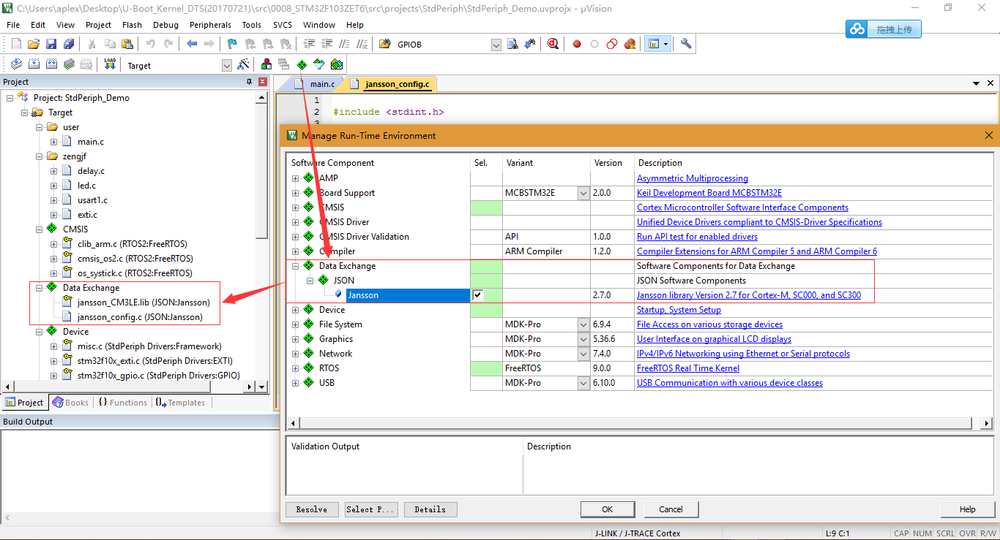

# Keil JSON Parse Lib

## 参考资料

* [【STM32】使用keil提供的JSON库——Jansson](http://blog.csdn.net/yannanxiu/article/details/52712723)
* [Jansson Documentation](https://jansson.readthedocs.io/en/2.10/)

## 添加Jansson库支持

* Download: [Keil.Jansson](https://www.keil.com/dd2/pack/#/Keil.Jansson)
* Project添加库：
  

## 注意事项

在有CMSIS RTOS里Jansson运作会出问题，目前没有去跟踪问题出在哪里。

## Test Demo
* 头文件:
  ```C
  #include <jansson.h>
  ```
* Demo Code:
  ```C
  #include "zengjf.h"
  
  //jansson Test
  void jansson_pack_test(void)
  {
      json_t *root;
      char *out;
      json_error_t error;
      
      printf("\r\n---------Jansson Test Begin---------\r\n");
  
      /* Build an empty JSON object */
      root = json_pack("{s:i}", "zengjf", 5);
  
      out = json_dumps(root, JSON_ENCODE_ANY);
      printf("encode json data: \r\n\t%s\r\n", out);
      
      free(root);
      free(out);
      
      root = json_loads("{\"zengjf\": \"5\", \"zengsf\": 6}", 0, &error);    
      if(!root)
      {
          printf("error: on line %d: %s\r\n", error.line, error.text);
      }
  
      out = json_dumps(root, JSON_ENCODE_ANY);
      printf("decode json data: \r\n\t%s\r\n", out);
      printf("show root[\"zengjf\"] value:%s\r\n", json_string_value(json_object_get(root, "zengjf")));
      printf("show root[\"zengsf\"] value:%d\r\n", (int)json_integer_value(json_object_get(root, "zengsf")));
      
      free(root);
      free(out);
      
      printf("---------Jansson Test Over---------\r\n");
  }
  ```
* 输出信息：
  ```JSON
   Hardware Auto Detect System.
   Version: 0.0.1
             ---- Designed By zengjf 
  
  ---------Jansson Test Begin---------
  encode json data: 
          {"zengjf": 5}
  decode json data: 
          {"zengjf": "5", "zengsf": 6}
  show root["zengjf"] value:5
  show root["zengsf"] value:6
  ---------Jansson Test Over---------
  ```
