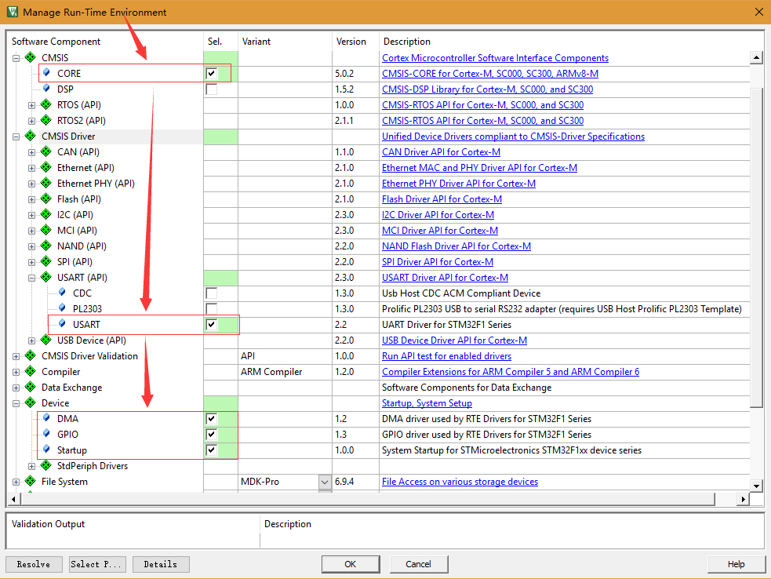
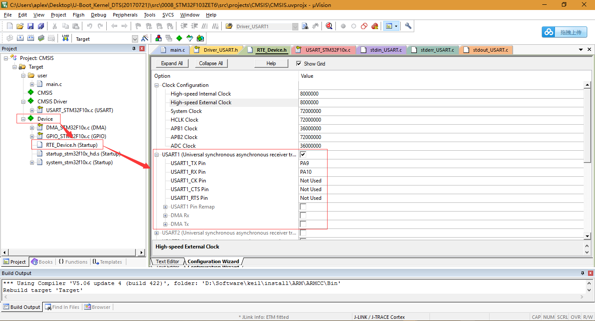
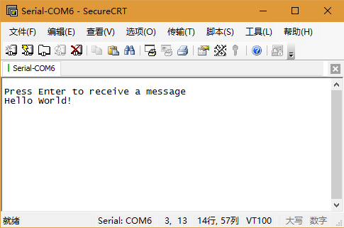
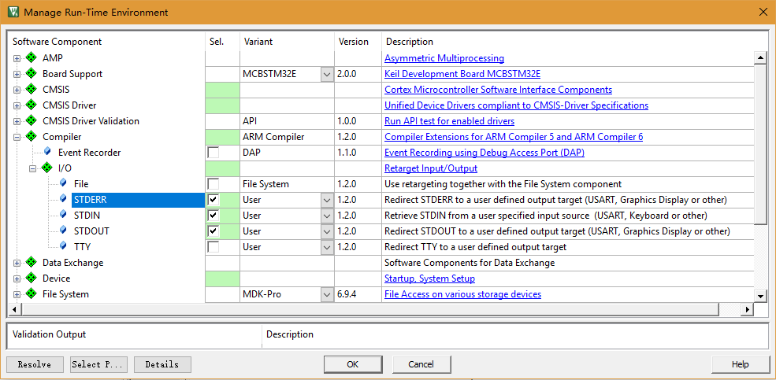
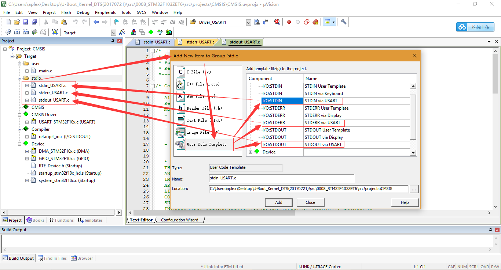
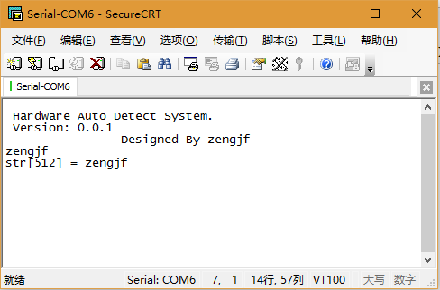

# CMSIS-Driver UART As Debug Port

## 参考资料

* [USART Interface](http://www.keil.com/pack/doc/CMSIS/Driver/html/group__usart__interface__gr.html)
* [使用keil MDK5.23的CMSIS Driver层的USART驱动](http://blog.csdn.net/u011976086/article/details/73236540)

## RTE Select



## RTE_Device Config



## UART1 Demo Code

* Source Code  
  ```C
  #include "Driver_USART.h"
  #include <stdio.h>
  #include <string.h>
  
  /* USART Driver */
  // 需要在RTE_Device.h中是有声明的，直接引用就行了
  extern ARM_DRIVER_USART Driver_USART1;
   
  void myUSART_callback(uint32_t event) { }
   
  int main()
  {
      static ARM_DRIVER_USART * USARTdrv = &Driver_USART1;
      char                   cmd;
   
      /*Initialize the USART driver */
      USARTdrv->Initialize(myUSART_callback);
      /*Power up the USART peripheral */
      USARTdrv->PowerControl(ARM_POWER_FULL);
      /*Configure the USART to 115200 Bits/sec */
      USARTdrv->Control(ARM_USART_MODE_ASYNCHRONOUS |
                        ARM_USART_DATA_BITS_8 |
                        ARM_USART_PARITY_NONE |
                        ARM_USART_STOP_BITS_1 |
                        ARM_USART_FLOW_CONTROL_NONE, 115200);
       
      /* Enable Receiver and Transmitter lines */
      USARTdrv->Control (ARM_USART_CONTROL_TX, 1);
      USARTdrv->Control (ARM_USART_CONTROL_RX, 1);
      char* sendstr = "\r\nPress Enter to receive a message";
      USARTdrv->Send(sendstr, strlen(sendstr));
       
      while (1)
      {
          USARTdrv->Receive(&cmd, 1);          /* Get byte from UART */
          if (cmd == 13)                       /* CR, send greeting  */
          {
            USARTdrv->Send("\r\nHello World!", 15);
          }
          cmd = 0;
   
      }
  }
  ```
* 调试输出信息：  
  

## UART1 As Debug Port

* RTE Select  
  
* 添加Stdio相关文件  
  
* 修改`stdin.USART.c/stderr_USART.c/stdout_USART.c`中的`stdin_init()/stderr_init()/stdout_init()`初始化函数，主要是因为这三个函数要么打开了RX，要么打开了TX，要同时支持RX/TX，就要添加这部分代码，如果都添加，那这三个函数功能是一致的，调用一个函数初始化就可以了，不过后续的demo中还是调用三个函数，示例：  
  ```C
  int stdout_init (void) {
    int32_t status;
   
    status = ptrUSART->Initialize(NULL);
    if (status != ARM_DRIVER_OK) return (-1);
   
    status = ptrUSART->PowerControl(ARM_POWER_FULL);
    if (status != ARM_DRIVER_OK) return (-1);
   
    status = ptrUSART->Control(ARM_USART_MODE_ASYNCHRONOUS |
                               ARM_USART_DATA_BITS_8       |
                               ARM_USART_PARITY_NONE       |
                               ARM_USART_STOP_BITS_1       |
                               ARM_USART_FLOW_CONTROL_NONE,
                               USART_BAUDRATE);
    if (status != ARM_DRIVER_OK) return (-1);
  
    status = ptrUSART->Control(ARM_USART_CONTROL_TX, 1);        // add this two line 
    if (status != ARM_DRIVER_OK) return (-1);    
    status = ptrUSART->Control(ARM_USART_CONTROL_RX, 1);        // or add this two line
    if (status != ARM_DRIVER_OK) return (-1);
   
    return (0);
  }
  ```
* 添加直接回显输入的字符：
  ```C
  /**
    Get a character from stdin
   
    \return     The next character from the input, or -1 on read error.
  */
  int stdin_getchar (void) {
    uint8_t buf[1];
   
    if (ptrUSART->Receive(buf, 1) != ARM_DRIVER_OK) {
      return (-1);
    }
    while (ptrUSART->GetRxCount() != 1);
    
    if (ptrUSART->Send(buf, 1) != ARM_DRIVER_OK) {
      return (-1);
    }
    while (ptrUSART->GetTxCount() != 1);
    
    if (buf[0] == '\r') {
        buf[0] = '\n';
      if (ptrUSART->Send(buf, 1) != ARM_DRIVER_OK) {
      return (-1);
      }
      while (ptrUSART->GetTxCount() != 1);
    } else if (buf[0] == '\n') {
        buf[0] = '\r';
      if (ptrUSART->Send(buf, 1) != ARM_DRIVER_OK) {
      return (-1);
      }
      while (ptrUSART->GetTxCount() != 1);
    }
    
    return (buf[0]);
  }
  ```
* main函数：
  ```C
  #include <stdio.h>
  #include <string.h>
  
  extern int stdout_init(void);
  extern int stdin_init(void);
  extern int stderr_init(void);
  
  #define array(x) sizeof(x)/sizeof(x[0])
  
  char str[512] = {0};
  
  int main()
  {
      stdout_init();    // 这三个函数分别在stdin_UART.c/stderr_USART.c/stdout_USART.c中
      stdin_init();
      stderr_init();
      
      printf("\r\n Hardware Auto Detect System.");
      printf("\r\n Version: 0.0.1");
      printf("\r\n           ---- Designed By zengjf \r\n");
      
      while(1) 
      {
          scanf("%s", str);
          printf("str[%d] = %s\r\n", array(str), str);
          memset(str, 0, array(str));
      }
  }
  ```
* 调试输出信息：  
  
