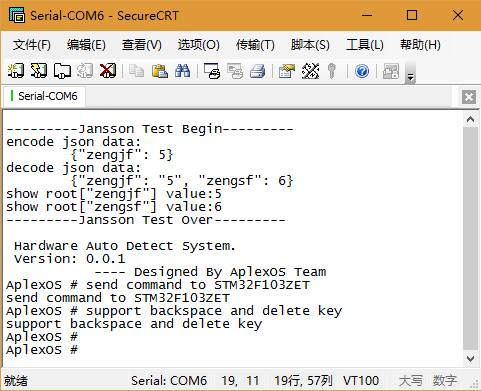
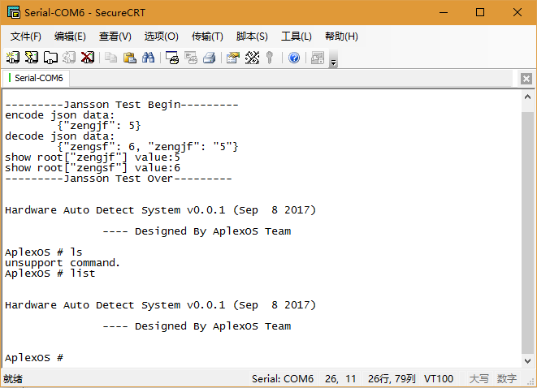

# Command Line Interpreter For STM32

## 参考资料

* [MicroCLI: A command-line interface (CLI) for the STM32F0-Discovery](https://github.com/christianjann/microcli-stm32f0-discovery)
* [MicroCLI: Befehlsinterpreter auf einem STM32F0-Discovery + WLAN + Handy-App](https://www.jann.cc/2012/08/13/microcli_befehlsinterpreter_auf_einem_stm32f0_discovery.html)
* [libemb](https://github.com/wendlers/libemb)
* [libshell for Command Line Interpreter](https://github.com/wendlers/libemb/tree/master/libshell)

## 获取需要解析的字符串

* 需求：
  * 获取串口输入的字符串；
  * 能够支持backspace/delete按键进行删除输入错误的字符；
  * string的buffer最大512字节；
* Example Code
  ```C
  #include "zengjf.h"
  
  // command
  #define CMD_BUF_SIZE 512
  char cmd_buf[CMD_BUF_SIZE] = {0};
  int cmd_buf_count = 0;
  
  void get_cmd_parser_char(void) 
  {
      char ch = getchar();
      
      if (ch == 127 || ch == 8) {
          --cmd_buf_count;
          
          if (cmd_buf_count < 0)
              cmd_buf_count = 0;
  
          if (cmd_buf_count > CMD_BUF_SIZE - 1)
              cmd_buf_count = CMD_BUF_SIZE - 1;
          
          cmd_buf[cmd_buf_count] = 0;
          printf("\033[1K\rAplexOS # %s", cmd_buf);
  
          return;
      } 
      else if (ch == '\r')
      {
          if (strlen(cmd_buf) == 0) 
              printf("AplexOS # ");
          else 
              printf("%s\r\nAplexOS # ", cmd_buf);
          
          memset(cmd_buf, 0, strlen(cmd_buf));
          cmd_buf_count = 0;
          
          return;
      }
      
      cmd_buf[cmd_buf_count++] = ch;
  }
  ```
* 输出显示  
  

## 命令解析

* 定义数据结构：
  ```C
  #ifndef __CMD_PARSER_H
  #define	__CMD_PARSER_H
  
  #include "zengjf.h"
  
  #define countof(a)   (sizeof(a) / sizeof(*(a)))
  
  /**
   * Definition of a single element
   */
  typedef struct
  {
      /**
       * Name of the element
       */
      const char     *cmd;
      
      /**
       * Name of the element
       */
      const char     *desc;
  
      /**
       * Value of the elment
       */
      int (*func)(char *args);
  
  } element_t;
  
  /**
   * All elements of the list
   */
  typedef struct
  {
      /**
       * Number of elements
       */
      short   count;
  
      /**
       * The elements
       */
      element_t   cmds[];
  } shell_cmds;
  
  extern char *welcome_msg;
  extern shell_cmds microcli_shell_cmds;
  
  int shell_process(char *cmd_line);
  
  void get_cmd_parser_char(void);
  
  #endif /* __CMD_PARSER_H */
  ```
* 命令解析、函数调用：
  ```C
  char* welcome_msg =
      "\r\n\r\nHardware Auto Detect System v0.0.1 (" __DATE__ ")\r\n"
      "\r\n               ---- Designed By AplexOS Team \r\n\r\n";
  
  int shell_cmd_list(char *args);
  
  shell_cmds microcli_shell_cmds =
  {
      .count = 1,
      .cmds  = {
          {
              .cmd     = "list",
              .desc    = "List available",
              .func    = shell_cmd_list,
          },
      },
  };
  
  int shell_cmd_list(char *args) 
  {
      printf("%s", welcome_msg);
      return 0;
  }
  
  int shell_process(char *cmd_line) 
  {
      int i = 0;
      for (i = 0; i < microcli_shell_cmds.count; i++) 
      {
          if (strncmp(microcli_shell_cmds.cmds[i].cmd, cmd_line, strlen(microcli_shell_cmds.cmds[i].cmd)) == 0) 
          {
              if (cmd_line[strlen(microcli_shell_cmds.cmds[i].cmd)] == ' ') 
              {
                  microcli_shell_cmds.cmds[i].func(&cmd_line[strlen(microcli_shell_cmds.cmds[i].cmd) + 1]);
              } else if(strlen(cmd_line) == strlen(microcli_shell_cmds.cmds[i].cmd)) {
                  microcli_shell_cmds.cmds[i].func(NULL);
              }
              
              return 0;
          }
      }
      
      printf("unsupport command.");
      return -1;
  }
  ```
* 测试输出信息：  
  

## libshell Source Code hacking

* [shell.h](https://github.com/wendlers/libemb/blob/master/libshell/src/include/shell.h)：主要是要理解其中的数据结构关系，参数的数据结构内容是运行时解析命令行字符串来填充的，命令是程序编码时就写好的。
  ```C
  ... 
  /**
   * Single command argument
   * 解析出来的参数会被保存在这个数据结构中，val长度是固定的
   */
  typedef struct {
       /**
        * Value representing the argument
        */
       char 			val[SHELL_MAX_ARG_LEN];
  } shell_cmd_arg;
  
  /**
   * All arguments from a single command line
   * 所有的参数会被保存在这个数据结构中，长度是固定的，其实从这里可以知道，这个结构体要提前分配
   */
  typedef struct {
       /**
        * Number of arguments
        */
       unsigned char	count;
  
       /**
        * The arguments
        */
       shell_cmd_arg	args[SHELL_MAX_ARGS];
  } shell_cmd_args;
  
  /**
   * Definition of a single shell command
   * 每一条shell命令的数据结构
   */
  typedef struct {
       /**
        * Name of the command
        */
       const char 	*cmd;
  
       /**
        * Description of the command
        */
       const char		*desc;
  
       /**
        * Functino called when executing the commmand
        */
       int (*func)(shell_cmd_args *args);
  } shell_cmd;
  
  /**
   * All shell commands knwon by the shell
   * 所有的命令存储在这里，这样可以用For循环进行迭代
   */
  typedef struct {
       /**
        * Number of commands
        */
       unsigned char		count;
  
       /**
        * The commands
        */
       shell_cmd			cmds[];
  } shell_cmds;
  ...
  ```
* [shell.c](https://github.com/wendlers/libemb/blob/master/libshell/src/shell.c)：主要是解析命令解析和参数解析部分。
  ```C
  ...
  int shell_arg_parser(char *cmd_line, int len,  shell_cmd_args *args)
  {
       int i;
       int j;
       int spos = 0;
       int argc = 0;
  
       for(i = 0; i < len; i++) {
            // to many arguments
            if(argc > SHELL_MAX_ARGS) return 1;
  
            // 第一个空格之前是命令本身，后续才是真的参数
            if(cmd_line[i] == ' ' || i == len - 1) {
                 // catch last argument ...
                 if(i == len - 1) i++;
  
                 // ignore first since it is the cmd itself
                 // 从这里开始拿第一个命令的参数
                 if(spos == 0) {
                      spos = i;
                 } else {
                      // argument value to long
                      // 参数过长
                      if(i - spos > SHELL_MAX_ARG_LEN) return 2;
  
                      // 拷贝参数
                      for(j = 0; j < i - spos - 1; j++) {
                           args->args[argc].val[j] = cmd_line[spos + 1 + j];
                      }
                      // 最后补充一个字符串结束符
                      args->args[argc++].val[j] = 0;
                      spos = i;
                 }
            }
       }
  
       args->count = argc;
  
       return 0;
  }
  
  int shell_process_cmds(shell_cmds *cmds, char *cmd_line)
  {
       int i;
       int ret;
       int cmd_len;
       int cmd_line_len;
  
       // 运行时shell命令参数，这个需要用到的空间还是比较大的，在RTOS下要注意栈空间的问题
       shell_cmd_args args;
  
       // 迭代命令条数
       for(i = 0; i < cmds->count; i++) {
  
            // 计算命令长度与当前匹配命令长度
            cmd_line_len 	= shell_str_len(cmd_line);
            cmd_len 		= shell_str_len((char *)(cmds->cmds[i].cmd));
  
            // 比较
            if(shell_str_cmp((char *)(cmds->cmds[i].cmd), cmd_line, cmd_len, cmd_line_len) == 0) {
                // 解析参数
                 ret = shell_arg_parser(cmd_line, cmd_line_len, &args);
  
                 if(ret == 1)
                      return SHELL_PROCESS_ERR_ARGS_MAX;
                 if(ret == 2)
                      return SHELL_PROCESS_ERR_ARGS_LEN;
  
                // 调用对应的函数
                 return (cmds->cmds[i].func)(&args);
            }
       }
  
       return SHELL_PROCESS_ERR_CMD_UNKN;
  }
  ```
