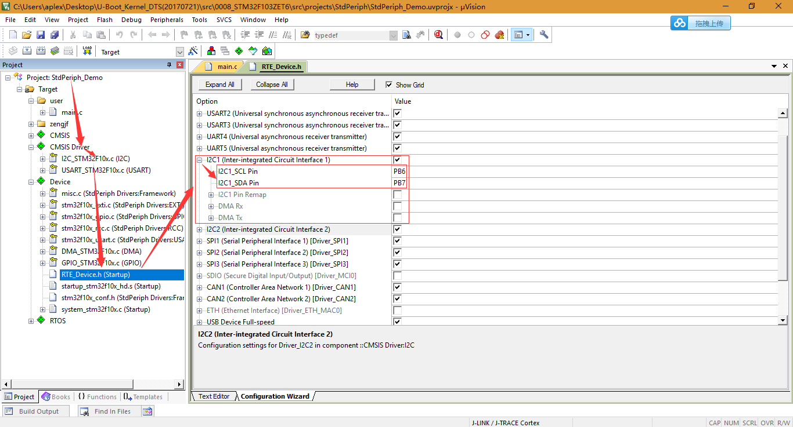

# CMSIS Driver I2C Slave

## 参考资料

* [CMSIS-Driver I2C Interface](https://www.keil.com/pack/doc/CMSIS/Driver/html/group__i2c__interface__gr.html)

## 硬件连接

* 主控硬件主板接口：  
  
* STM32 I2C Salve引脚选择：  
  
* STM32连接主控板I2C Port：  
  

## 示例

* Source Code
  ```C
  // I2C driver instance
  extern ARM_DRIVER_I2C Driver_I2C1; 
  static ARM_DRIVER_I2C *i2cDev = &Driver_I2C1;
   
  static volatile uint32_t event = 0;
   
  static void I2C_DrvEvent (uint32_t e) {
      event |= e;
  }
  
  void vTaskI2C0(void *p)
  {
      uint8_t cnt = 0;
   
      /* Initialize I2C peripheral */
      i2cDev->Initialize(I2C_DrvEvent);
   
      /* Power-on SPI peripheral */
      i2cDev->PowerControl(ARM_POWER_FULL);
   
      /* Configure USART bus*/
      i2cDev->Control(ARM_I2C_OWN_ADDRESS, 0x33);
      
      printf("\r\nI2C0 thread start.\r\n\r\n");
   
      while (1) {
          /* Receive chuck */
          i2cDev->SlaveReceive(&cnt, 1);
          while ((event & ARM_I2C_EVENT_TRANSFER_DONE) == 0);
          event &= ~ARM_I2C_EVENT_TRANSFER_DONE;
          
          printf("Receive a byte data: %x\r\n", cnt);
   
          /* Transmit chunk back */
          i2cDev->SlaveTransmit(&cnt, 1);
          while ((event & ARM_I2C_EVENT_TRANSFER_DONE) == 0);
          event &= ~ARM_I2C_EVENT_TRANSFER_DONE;
          
          printf("Send a byte data: %x\r\n", cnt);
      }
  }
  ```
* 主控板i2c-tools访问设备：
  ```shell
  [aplex@root ~]#  i2cdetect -y -r 1
       0  1  2  3  4  5  6  7  8  9  a  b  c  d  e  f
  00:          -- -- -- -- -- -- -- -- -- -- -- -- -- 
  10: -- -- -- -- -- -- -- -- -- -- -- -- -- -- -- -- 
  20: -- -- -- -- -- -- -- -- -- -- -- -- -- -- -- -- 
  30: -- -- -- 33 -- -- -- -- -- -- -- -- -- -- -- -- 
  40: -- -- -- -- -- -- -- -- -- -- -- -- -- -- -- -- 
  50: UU -- -- -- -- -- -- -- -- -- -- -- -- -- -- -- 
  60: -- -- -- -- -- -- -- -- -- -- -- -- -- -- -- -- 
  70: -- -- -- -- -- -- -- --                         
  [aplex@root ~]#  i2cset -f -y 1 0x33 0x55
  [aplex@root ~]#  i2cget -f -y 1 0x33 
  0x55
  [aplex@root ~]#        
  ```
* STM32 Debug Port：
  ```shell
  Hardware Auto Detecead start.t System v0.0.1 (Sep  9 2017)
  
                 ---- Designed By AplexOS Team 
  
  AplexOS # Receive a byte data: 0
  Send a byte data: 55
  Receive a byte data: 55
  
  AplexOS # 
  ```
