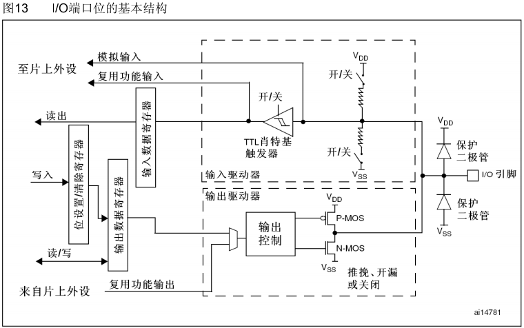
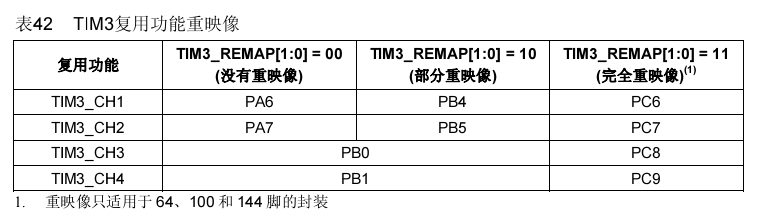
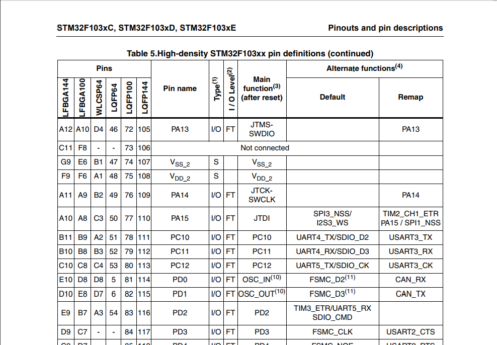

# GPIO AFIO STM32 Datasheet Hacking

## 参考资料

* [如何正确的理解漏极开路输出跟推挽输出？](https://www.zhihu.com/question/28512432)
* [STM32的GPIO的复用功能和重映射功能](http://blog.csdn.net/h_kingone/article/details/53161198)
* [[应用相关] 对于STM32 GPIO复用和重映射理解](http://bbs.21ic.com/icview-1013708-999-1.html)

## GPIO输入端口架构

## GPIO 复用功能

* 示例说明：  
  对于STM32F103VBT6，47引脚为PB10，它的复用功能是I2C2_SCL和 USART3_TX，表示在上电之后它的默认功能为PB10，而I2C2的SCL和USART3的TX为它的复用功能；另外在TIM2的引脚重映射后，TIM2_CH3也成为这个引脚的复用功能。
* 库函数GPIO_PinRemapConfig就是用来重映射使用的，参考[../tools/stm32f10xxx_datasheet_cn.pdf page 119](../tools/stm32f10xxx_datasheet_cn.pdf)：  
  
  * 就拿你说的TIM3-CH1如果没有映射的时候对应PA6。
  * TIM3-CH1如果部分重映射的对应PB4，使用下面的库函数设置：  
    `GPIO_PinRemapConfig(GPIO_PartialRemap_TIM3, ENABLE);`  //Timer3部分重映射TIM3_CH1->PB4   
  * TIM3-CH1如果完全重映射的对应PC6，使用下面的库函数设置：  
    `GPIO_PinRemapConfig(GPIO_FullRemap_TIM3, ENABLE);`        //Timer3完全重映射 TIM3_CH1->PC6 
* 引脚复用图示：  
  
  * Main function(3) (after reset)：上电复位默认功能；
  * Alternate functions(4) Default：选择复用模式之后，可能的功能，这里的功能可能同一引脚有多个功能，这里没有配置，所以在Pin选择的时候，要注意，不要让这里有重复；
  * Alternate functions(4)  Remap：该引脚可以重映射添加的功能；

## 注意事项

之前看Datasheet的引脚复用图，一直用i.MX6/AM335x芯片的思维在思考，以为多个复用功能有特殊的寄存器可以进行选择，一直找不到这个寄存器，后来才知道，这个没有寄存器，要通过人为避免。
