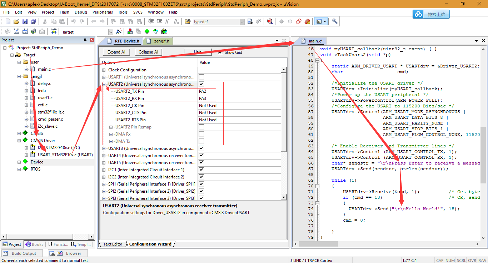
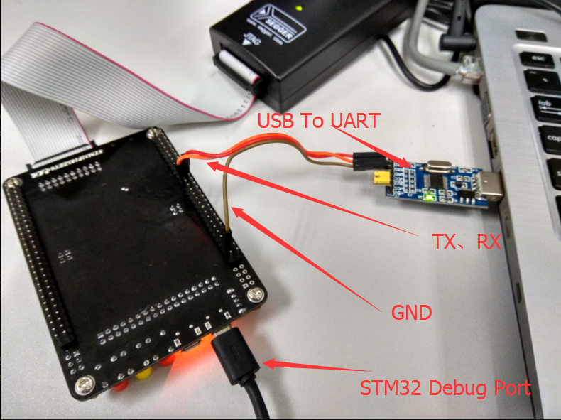

# CMSIS Driver UART2 Port

## 参考资料

* [CMSIS-Driver USART Interface](http://www.keil.com/pack/doc/CMSIS/Driver/html/group__usart__interface__gr.html)
* [CMSIS-Driver UART As Debug Port](https://github.com/ZengjfOS/MiCONotes/blob/master/src/0008_STM32F103ZET6/src/013_CMSIS-Driver_UART_As_Debug_Port.md)

## 硬件连接

* STM32 I2C Salve引脚选择：  
  
* STM32连接主控板I2C Port：  
  

## 示例

* Source Code
  ```C
  /* USART Driver */
  extern ARM_DRIVER_USART Driver_USART2;
   
  void myUSART_callback(uint32_t event) { }
  void vTaskUsart2(void *p)
  {
      static ARM_DRIVER_USART * USARTdrv = &Driver_USART2;
      char                   cmd;
   
      /*Initialize the USART driver */
      USARTdrv->Initialize(myUSART_callback);
      /*Power up the USART peripheral */
      USARTdrv->PowerControl(ARM_POWER_FULL);
      /*Configure the USART to 115200 Bits/sec */
      USARTdrv->Control(ARM_USART_MODE_ASYNCHRONOUS |
                        ARM_USART_DATA_BITS_8 |
                        ARM_USART_PARITY_NONE |
                        ARM_USART_STOP_BITS_1 |
                        ARM_USART_FLOW_CONTROL_NONE, 115200);
       
      /* Enable Receiver and Transmitter lines */
      USARTdrv->Control (ARM_USART_CONTROL_TX, 1);
      USARTdrv->Control (ARM_USART_CONTROL_RX, 1);
      char* sendstr = "\r\nPress Enter to receive a message";
      USARTdrv->Send(sendstr, strlen(sendstr));
       
      while (1)
      {
          USARTdrv->Receive(&cmd, 1);          /* Get byte from UART */
          if (cmd == 13)                       /* CR, send greeting  */
          {
            USARTdrv->Send("\r\nHello World!", 15);
          }
          cmd = 0;
  
      }
  }
  ```
* USB To UART Port：
  ```shell
  Press Enter to receive a message
  Hello World!
  Hello World!
  Hello World!
  Hello World!
  Hello World!
  Hello World!
  Hello World!
  Hello World!
  Hello World!
  ```
